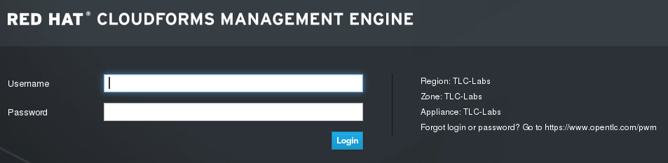
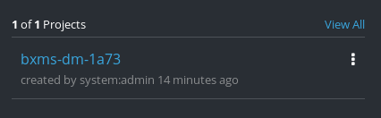
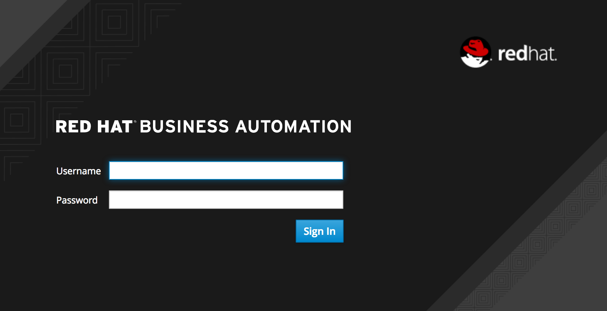
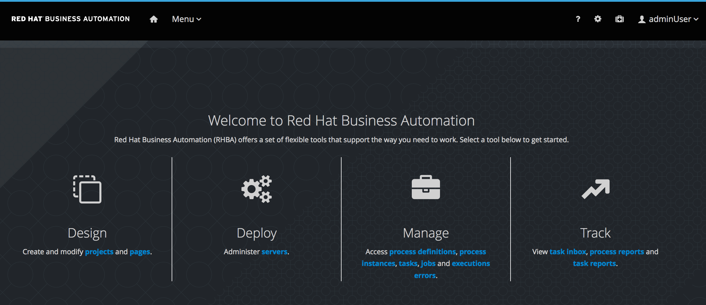

:scrollbar:
:data-uri:
:toc2:
:bpmsuite_template: link:https://raw.githubusercontent.com/gpe-mw-training/bxms_decision_mgmt_foundations_lab/master/bpmsuite70-full-mysql.json[BPM Suite Template^]
:bpmsuite_mysql_secret: link:https://raw.githubusercontent.com/gpe-mw-training/bxms_decision_mgmt_foundations_lab/master/bpmsuite-app-secret.json["BPM Suite - MySql Secret^"]
:linkattrs:

== Environment Setup Lab

The first two labs of this course provide an overview of the _Business Central_ and _Process Server_ components of Red Hat Process Automation Manager.

In this lab, you use Red Hat OpenShift Container Platform to provision a Business Central environment. You use this environment to create your business assets.

.Goals
* Order a Red Hat Process Automation Manager lab environment
* Log in to the Business Central web application

.Prerequisites
* Broadband internet connectivity
* An up-to-date browser, such as Google Chrome or Firefox
* Red Hat Online Partner Enablement Network--Training Learning Center (OPENTLC) credentials

:numbered:

== Set Up Red Hat Process Automation Manager Environment

In this section, you first register for the ability to create a project in your remote OpenShift lab environment.
Then, you order a Red Hat Process Automation Manager lab environment from a catalog entry in a Red Hat CloudForms environment administered by the OPEN team.

. In your browser, navigate to the link:https://labs.opentlc.com/[OPENTLC lab portal^]:
+

. Enter your OPENTLC username and password, and click *Login*.
. Navigate to *Services -> Catalogs -> OPENTLC Middleware Solutions Labs*:
+
image::images/cf_course_selection_project.png[]

. Select `BXMS PAM` and then click *Order*:
+
image::images/bxms_pam_cf.png[]

. In the next panel, click *Submit* in the lower right corner.
* This initiates a process to provision a full Red Hat Process Automation Manager lab environment.
This lab environment is provisioned in a Red Hat OpenShift Container Platform (RHOCP) cloud environment administered by Red Hat's OPEN team.

. Within 5 to 10 minutes, expect to receive an email with contents similar to the following:
+
[source,text]
-----
...
Please take note of your unique identifier, GUID: 05c4
...

Your environment will be hosted in our shared cluster, accessible at: https://master.dev37.openshift.opentlc.com

...

NOTICE: Your environment will expire and be deleted in 7 day(s) at 2018-02-27 00:00:00 -0500 and will be idled down after 8 hour(s).
-----
* This email confirms that your Red Hat Process Automation Manager project is created.

. Save the email.
* The email includes a GUID--a unique four-character identifier generated for your lab environment.
* Whenever you see "GUID" or "$GUID" in a command, make sure to replace it with your GUID.

. Pay particular attention to the URL of the OpenShift Container Platform master node referenced in this email.
* It is likely that the URL listed in your email is different from the URL in this sample email snippet.
* For the duration of the course, you navigate to this OpenShift Container Platform master node.

== Review OpenShift Container Platform Components

. Using an internet browser, navigate to the URL of Red Hat OpenShift Container Platform mentioned in the lab confirmation email.
. Log in to OpenShift Container Platform using your OPENTLC credentials:
+
image::images/ocp-login.png[]

* When you log in to the OpenShift Container Platform, expect to see the available projects in the right panel of the home screen:
+

. Select the project with the name similar to `bxms-pam-$GUID`.

=== Explore Deployments

. In the left panel of your Red Hat OpenShift Container Platform project home page, navigate to *Applications -> Deployments*.

. Examine the three deployments and expect to see that they all have a status of `Active, 1 replica`:
+
image::images/initial_deployments.png[]

. Review the descriptions of each of these applications:
+
[cols="1,4",options="header"]
|=====
| Application Name | Description
|`gpte-kieserver` | Process Server component where process execution occurs
|`gpte-ng-dmf` | Angular web application that interacts with RESTful API of Process Server container
|`gpte-rhpamcentr` | Business Central component where version-controlled process and rule authoring occurs
|=====

=== Explore Routes
. In the left panel, navigate to the *Applications -> Routes* section.
. Note the URL to your `gpte-rhpamcentr` route:
+
image::images/external-route.png[]

== Log In to Business Central

. Click the link to open a new tab in your browser showing the Business Central web application of Red Hat Process Automation Manager:
+

. Log in to Business Central using these credentials:
* *Username*: `adminUser`
* *Password*: `test1234!`

* Verify that you see the Business Central home page:
+

== Review Known Issues

Red Hat's engineering team is investigating two known issues--Business Central's long load time and the display of incorrect information.

.Long Load Times

Sometimes Business Central takes a long time to load. You can refresh your browser to make use of your browser cache and improve the load time in subsequent attempts to load the UI.

.Inconsistent State

In some cases, Business Central does not correctly display the expected information on a page after an action or remains in the loading state.

* In this case, you can press the `F5` key to refresh your browser and reload the Business Central web page.
* When you try the exercise again, you can expect it to work.
