:scrollbar:
:data-uri:
:toc2:

== Assets Navigation Lab

This module showcases the Business Central environment provisioned during the _Environment Setup Lab_. The business assets are retrieved from the `Mortgage Demo` project, one of the demonstration projects available on https://github.com/jbossdemocentral/rhpam7-mortgage-demo-repo[JBoss Demo Central].

In this lab, you will import the `Mortgage Demo` project in the Business Central workbench of Red Hat Process Automation Manager 7.
You will navigate the project's assets, like process definitions, rules and forms, in the project's library.
You will build and deploy the project onto the the Process Server, the platform's ligth-weight runtime engine, after which we will start a Mortgage Application process instance.
Finally, you will explore the runtime process and task management using the process instance created in the previous step.

.Goals
* Become familiar with business assets and their organization
* Become familiar with the business asset icons and representations
* Search for and open business assets for viewing and editing
* Become familiar with the build and deployment process
* Start a process instance and explore process and task runtime administration

.Prerequisites
* Successful completion of the _Environment Setup Lab_
* Successful login to Business Central

:numbered:

== Import Project

The Business Central project library view is displayed when you click *Design* from the Business Central home page, or when you naviage the menu: *Menu -> Design -> Projects*.

The project library view shows available projects in the library. If the library is empty, it shows "Nothing Here":

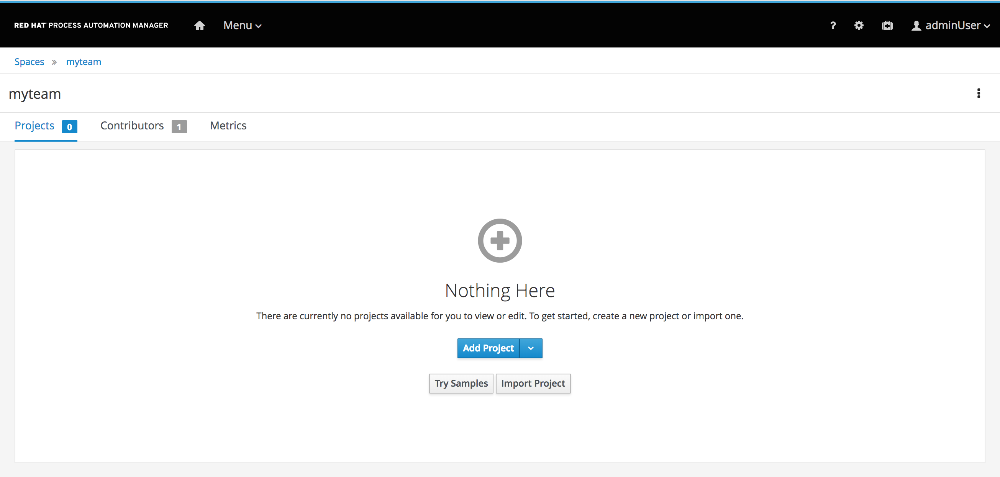

With an empty project library view, you have the option to create a project, try a sample, or import an existing project.

In this lab we will import an existing project, the `Mortgage Demo` from the https://github.com/jbossdemocentral/rhpam7-mortgage-demo-repo[JBoss Demo Central Github repository].

. From the empty project library view, click *Import Project*.
* Expect to see an *Import Project* dialog where you specify a Git repository URL for the project.
. In the *Import Project* dialog, enter `https://github.com/jbossdemocentral/rhpam7-mortgage-demo-repo` for *Repository URL* and click *Import*:
+
image::images/import_pamf_lab2.png[]
* If the repository contains multiple projects, you will be asked which project you would like to import. In this case the repository only contains the `Mortgage Demo` project, which will be imported immedetialy.
* When the import is completed, the project library view appears with the `Mortgage Demo` project selected:
+
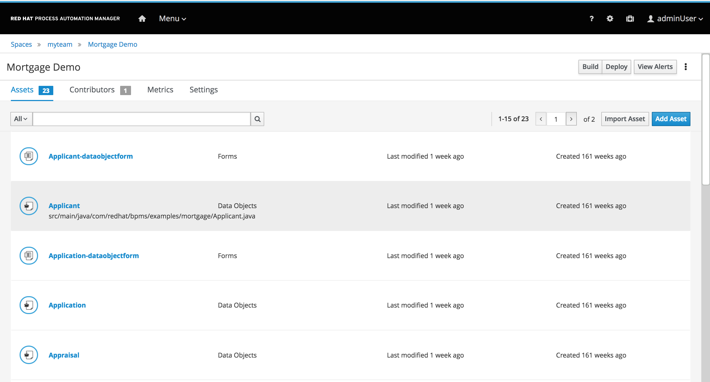

== Navigate Project Library

The project library view shows a tabular list of the assets in the project.
The tabular list allows the user to:

* Filter assets by type.
* Search for assets.
* Navigate between asset pages.

=== Filter assets by type
At the top left of the tabular list of assets, you see drop-down list. The list allows you to filter the assets by type.

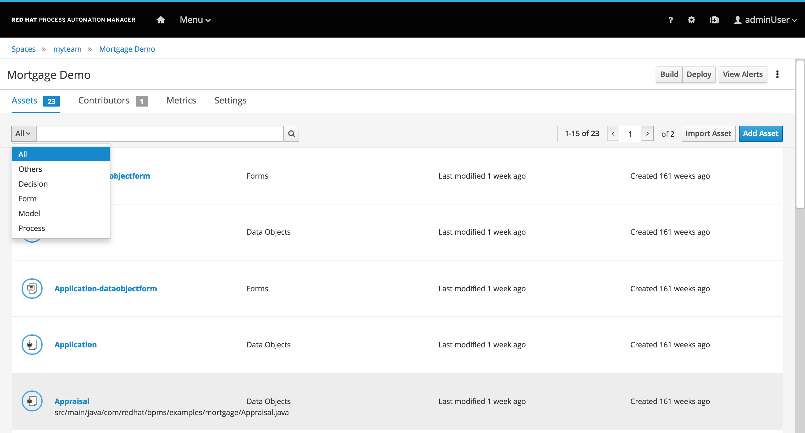

. Filter on `Process`
. Filter on `Decision`
. Filter on `Model`
. Filter on `Form`
. Set the filter to `All`

=== Search for Assets

At the top of the tabular list of assets, you see a search input field.
The grid is filtered by the asset's fully-qualified name, and the match is not case-sensitive.

image::images/search_by_name.png[]

. Search for `gdst`.
. Search for `Mortage`.
. Search for `Validate`.
. Clear the search field.

=== Navigate between asset pages

At the top right of the tabular list of assets, there is a pagination control that allows the user to navigate between pages.

. Find the page controller.
. Navigate to the next page and back.

=== Explore the Process Definition
. In the Asset Library view, use the asset filter to filter on *Processes*
. Open the `MortageApplication` process, this is the process we will be using in the remainder of this lab.
. In the process designer, explore the process. Identify the different BPMN2 constructs used, like *Business Rule Task*, *Human Task*, *X-OR Gateway* and *Swimlane*.
. Try to follow a process path from start to finish, and get a high-level understanding of the process semantics.

== Download Project

Projects can be exported so you can use them to upload to a source code repository and import them later into another instance of Business Central or distribute them outside the environment where they were created.

=== Export Project

To export the project, you start from Business Central's home page.

. Click the *Home* icon from the upper panel to access the Business Central home page.
. Click *Design* to display the project list.
* Note that the empty project library view you saw earlier is now populated with the `Mortgage Demo`.
. Select the `Mortgage Demo` project.
* This shows the project's library view with a list of its assets.
. Select the `Applicant` asset, the second asset in the table, and if the *Project Explorer* panel is not displayed, click the blue *>* icon to open it.
* This opens the *Project Explorer* perspective:
+
image::images/project-explorer-perspective.png[]
*  The *Project Explorer* view is accessible only when you select any of the assets from the project's library view.
. Click the gear icon in the *Project Explorer* panel and select *Download Project*
to trigger the download in your browser:
+
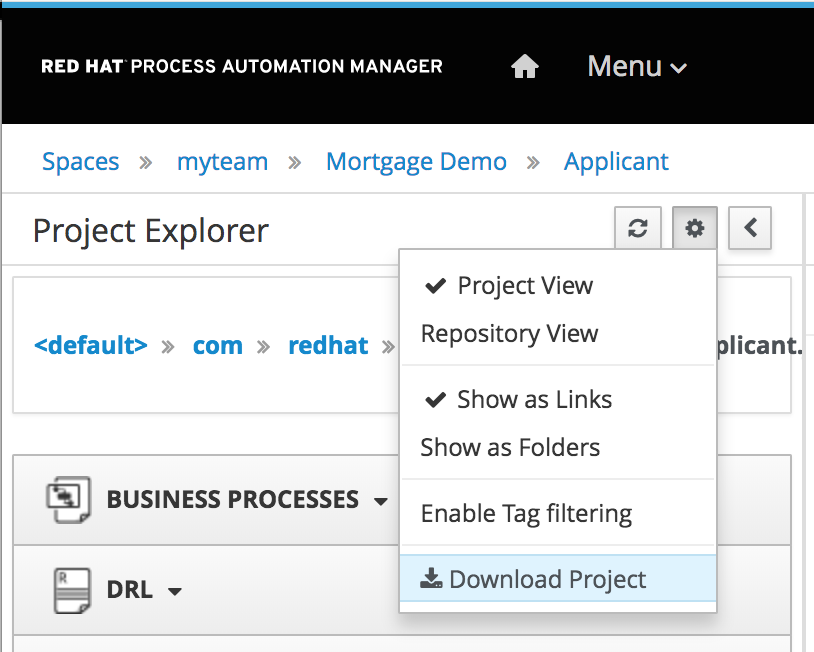
* A ZIP file containing the package structure of your project is downloaded to your `Downloads` folder. The name of the ZIP file is structured like this: `[Space Name]-[Repository Name]_[project name].zip`.
* Expect to find a file called `MySpace_examples-rhpam7-mortgage-demo-repo.zip` in your `Downloads` folder.
+
[NOTE]
In some cases, the file name may be missing a `[Space Name]-` prefix.

=== Deploy Mortgages Demonstration Project

It is useful to know how to create an executable component from a project. Executable components are stored in a binary repository (Maven) so that they can be used as dependencies for other projects. Executable components are also distributed to _execution servers_. Execution servers are the runtime containers that allow process execution from the Business Central workbench and client applications.

In this section, you deploy the `Mortgage Demo` demonstration project and use the Business Central workbench to test the deployment.

The `Mortgage Demo` demonstration project is a Process Automation Manager project intended to demonstrate the use of Process Server to execute a Mortgage Application business  process.

. Click the *Home* icon from the upper panel to access the Decision Central home page.
. Click *Design* to show the project list.
. Select the `Mortgage Demo ` project.
* This shows the project's library view with a list of its assets.
. Click *Deploy* from the set of buttons in the upper right.
* Expect to see confirmation of a successful deployment.
. Click the *Home* icon from the upper panel.
. Click *Deploy* to display the *Deploy* perspective.
* This shows the list of servers and containers:
* Alternatively, you can click *Menu -> Deploy -> Execution Servers* to navigate to the server page.
+
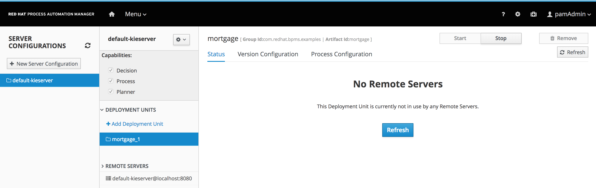
. Verify that the `mortgage_1` KIE container shows a green circle with a checkmark, indicating successful deployment.
+
[NOTE]
====
Note that the IP address for the remote server is an internal host IP address for the OpenShift environment. This means that while the IP address is accessible from within the OpenShift platform components, you cannot access this IP address from outside the OpenShift environment--for example, from your browser.
In order to access the KIE containers from outside the OpenShift environment, you need a Process Server route, which you get from the list of pods in OpenShift Container Platform.
====
. If you are not already logged in to OpenShift Container Platform, log in using your OPENTLC credentials:
+
image::images/ocp-login.png[]

. Select the Process Automation Manager project from your project list:
+
image::images/projects-list.png[]

. Locate the Process Server deployment whose name begins with `gpte-kieserver` in the list and click the *>* icon to the left to display details of this deployment:
+
image::images/external-route-execution-server.png[]
**TODO: UPDATE IMAGE!**

. From the *Networking* section in the Process Server pod, select one of the entries under *ROUTES External Traffic* and open the link in a new window.
. By default the Process Server route needs additional details about the information that you are requesting.
* Expect to see a `Forbidden` message result:
+
image::images/execution-server-forbidden.png[]
**TODO: UPDATE IMAGE**

. Add `/docs` to the end of the URL in your browser route.
* Expect to see the KIE server remote API reference documentation:
+
image::images/execution-server-rest-api.png[]
. Navigate to the **KIE Server :: Core** section.
. Click on the **GET /server/conainers** entry to expand the section.
. Click on the *Try it out* button on the right.
. Leave all the fields empty and click on the *Execute* button.
. The *Server Response* section will show the response confirming the existence of the the `mortgage` container.
+
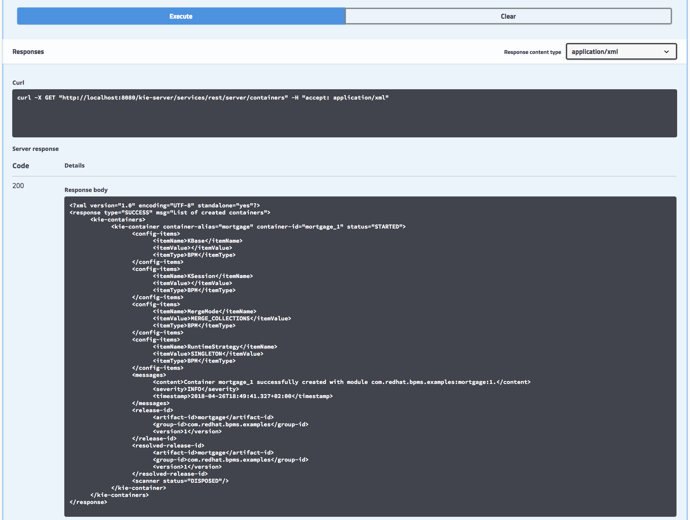
+
[NOTE]
====
The RESTful endpoint of Process Server are _secured resources_. This means that you need to present credentials to access the resource, for example when you press the _Execute_ button in the API documentation. You use the same credentials (`adminUser` for the username and `test1234!` for the password) that you used for entering Decision Central from the _Environment Setup Lab_ .
====

== Execute Test Cases

In this section, you execute a number of test scenarios:

* A mortgage application with human task that requests increase of downpayment and manual appraisal. Mortgage will be accepted.
* A mortgage application with human task that requests increase of downpayment and manager task to manually approve the appliction. Mortgage will be denied.

=== Test Approved Mortgage Loan Application

In this section, you use the following example data to generate an approved response from the engine:

[cols="2",options="header"]
|=======================================
|Field|Value
|*Applicant Name*| `John Doe`
|*Social Security Number*| `123456789`
|*Annual Income*| `70000`
|*Property Address*| `Rotterdam, The Netherlands`
|*Sale Price*| `240000`
|*Mortgage Amortization*| `10`
|*Down Payment*| `40000`
|=======================================

To test the process, navigate to the *Process Definitions* page in Business Central which lists all the process definitions deployed on the execution servers: The Business Central project library view is displayed when you click *Design* from the Business Central home page, or when you naviage the menu: *Menu -> Manage -> Process Definitions*.

image::images/manage-process-definitions.png[]

. To start a process instance, click on the kebab icon on the right of the MortgageApplication process definition and click on *Start*.
. In the process start form, fill in the data as provided in the table above.
. Click *Submit*.
* Expect to see a pop-up dialog indicating that a `Process Id: {x} started!`
. The process instance has now started. You can examine the details of the process instance on the *Process Instances* page: *Menu -> Manage -> Process Instances*.
* Click on the Mortgage Application process instance you've just started to go to the *details* page.
* Click on the *Diagram* tab to show the process diagram.
* The greyed-out nodes mark the nodes that have already been processed. The node in which the process is currently waiting is marked with a red border.

image::images/mortgage-application-process-instance-diagram.png[]

[start=5]
. The process is waiting at the Human Task *Suggest Down Payment Increase*.
. Navigate to the *Task Inbox* screen: *Menu -> Track -> Task Inbox*.
. Click on the *Suggest Downpayment Increase* task to open the task form.
. Click on *Claim*. This will assign the task to you and will remove the task from the task list other users in your group. This makes sure that only one person at a time can work on a certain task.
. Click on *Start* to start working on the task. This will make the `Down Payment` textbox editable.
. Increase the `Down Payment` to `100000` and click *Complete*.

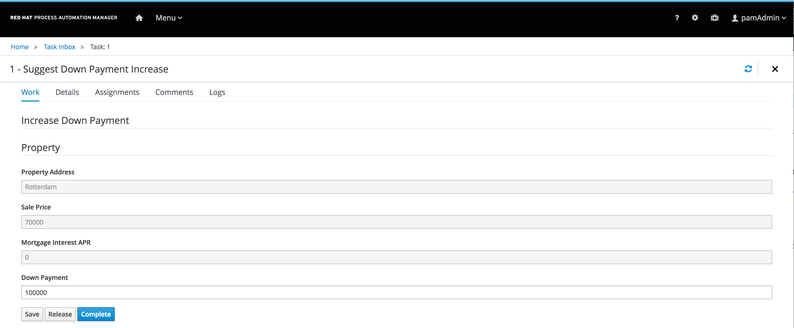

[start=11]
. Navigate back to the process instance: *Menu -> Manage -> Process Instances*.
. Open the process instance and navigate to the diagram.
. Observe that the process instance has progressed and is now waiting on the *Manually Appraise Borrower* task.

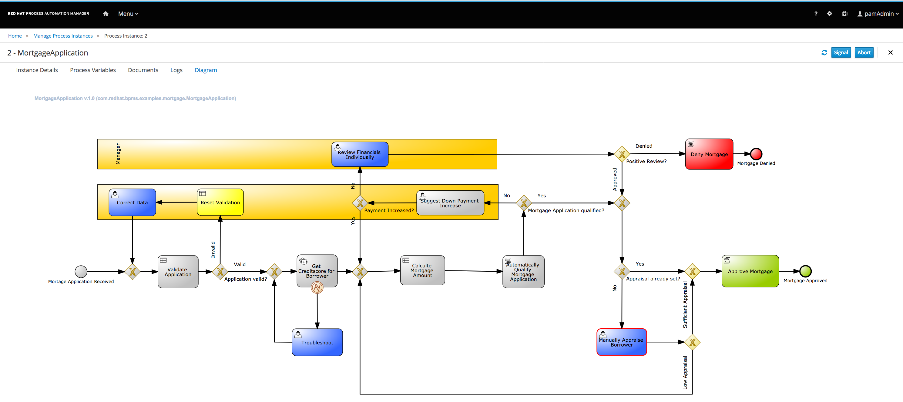

[start=14]
. Navigate to the *Task Inbox* screen: *Menu -> Track -> Task Inbox*.
. Click on the *Manually Appraise Borrower* task to open the task form.
. Click on *Claim*.
. Click on *Start* to start working on the task. This will make the `Appraised Value` textbox editable.
. Set the `Appraised Value` to `220000` and click *Complete*.

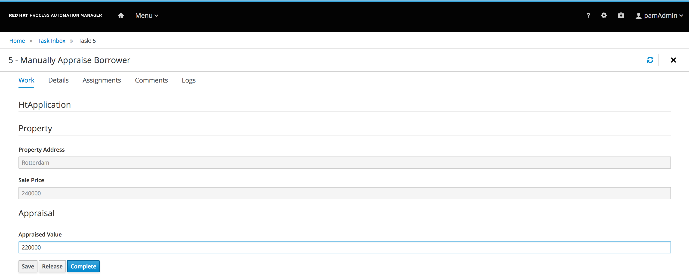

[start=19]
. Go back to the process instance page: *Menu -> Manage -> Process Instances*
. Notice that the process instance is gone.
. In the panel on the left of the screen, enable the *State > Completed* checkbox.

image::images/process-instance-filter-state-completed.png[]

[start=22]
. Click on the completed process instance to open the details page.
. Open the process instance diagram and observe that the mortgage has been approved.

image::images/process-instance-diagram-mortgage-approved.png[]

=== Examine Suggest Down Payment Increase task form

In this section, we inspect the task form of the *Suggest Down Payment Increase* human task.

. Log in in to Business Central .
* If you have closed your Business Central browser tab and need additional instructions on how to access Business Central, refer to the section that reviews the OpenShift Container Platform components in the previous lab.
. Navigate to the `Mortgage_Demo` project.
. Set the filter in the Asset Library to *Form* and type *downpayment* in the search field
. Open the *IncreaseDownPayment-taskform* form.
. Observe the components on the left of the editor. These components can be dragged and dropped onto the canvas to quickly create and edit forms in WYSIWYG-style.
. Click on the kebab icon on the canvas on the right of *Increase Down Payment* and click on *Edit*.
. Observe the *Nested Form* field. This means that this form is actually defined by another, nested, form called *IncreaseDownPayment-Application-dataobjectform*.
. Click on *Cancel*
. Go back to the Asset Library and find and open the *IncreaseDownPayment-Application-dataobjectform*.
. Open the *Model Fields* in the *Components* menu on the left side of the editor.
. Observe the additional fields that can be added to the form. These are all fields of the `Application` data model.
. Click on the kebab icon on the canvas on the right of *Down Payment*.
. Change the text in the *Help Message* field to *Please increase down payment.* and click on *OK*.
. Observe the *i* icon next to the *Down Payment* field.
* However over this icon.
* A pop-up should display with the text we've just entered.
. Return to the Asset Library.
+
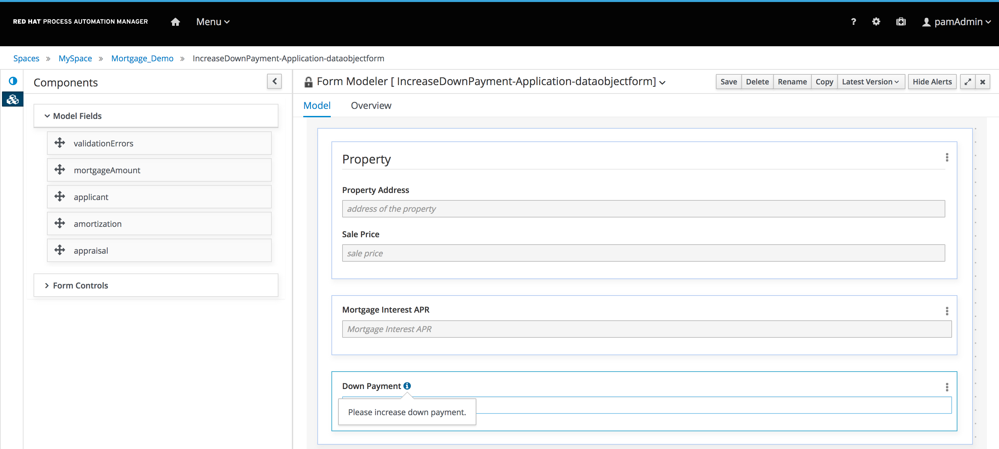

=== Test Reject Mortgage Application due to insufficient down payment.

In this section, we will use the same mortgage application data as in the previous section.
However, in this scenario, we will not increase the down payment, which now requires a manual approval from the manager.
As a manager, we will reject the application.

You use the same example data as in the previos test:

[cols="2",options="header"]
|=======================================
|Field|Value
|*Applicant Name*| `John Doe`
|*Social Security Number*| `123456789`
|*Annual Income*| `70000`
|*Property Address*| `Rotterdam, The Netherlands`
|*Sale Price*| `240000`
|*Mortgage Amortization*| `10`
|*Down Payment*| `40000`
|=======================================

To test the process, navigate to the *Process Definitions* page in Business Central which lists all the process definitions deployed on the execution servers: The Business Central project library view is displayed when you click *Design* from the Business Central home page, or when you naviage the menu: *Menu -> Manage -> Process Definitions*.

image::images/manage-process-definitions.png[]

. To start a process instance, click on the kebab icon on the right of the MortgageApplication process definition and click on *Start*.
. In the process start form, fill in the data as provided in the table above.
. Click *Submit*.
* Expect to see a pop-up dialog indicating that a `Process Id: {x} started!`
. The process instance has now started. You can examine the details of the process instance on the *Process Instances* page: *Menu -> Manage -> Process Instances*.
* Click on the Mortgage Application process instance you've just started to go to the *details* page.
* Click on the *Diagram* tab to show the process diagram.
* The greyed-out nodes mark the nodes that have already been processed. The node in which the process is currently waiting is marked with a red border.

image::images/mortgage-application-process-instance-diagram.png[]

[start=5]
. The process is waiting at the Human Task *Suggest Down Payment Increase*.
. Navigate to the *Task Inbox* screen: *Menu -> Track -> Task Inbox*.
. Click on the *Suggest Downpayment Increase* task to open the task form.
. Click on *Claim*. This will assign the task to you and will remove the task from the task list other users in your group. This makes sure that only one person at a time can work on a certain task.
. Click on *Start* to start working on the task. This will make the `Down Payment` textbox editable.
. This time, we will not increase the down payment, but we'll simply click on *Submit*

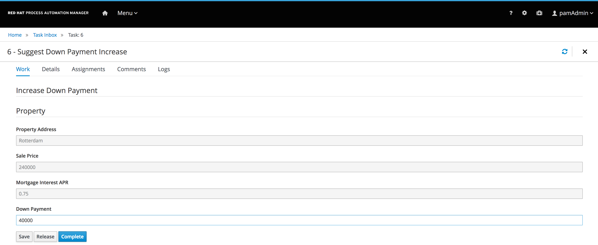

[start=11]
. Navigate back to the process instance: *Menu -> Manage -> Process Instances*.
. Open the process instance and navigate to the diagram.
. Observe that the process instance has progressed and is now waiting on the *Review Financials Individually* task.

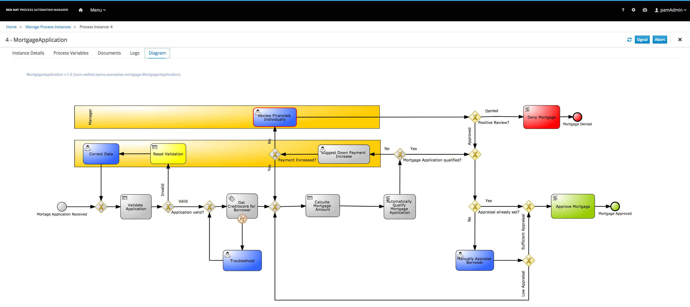

[start=14]
. Navigate to the *Task Inbox* screen: *Menu -> Track -> Task Inbox*.
. Click on the *Review Financials Individually* task to open the task form.
. Click on *Claim*.
. Click on *Start* to start working on the task.
. Scroll down to the bottom of the form. Leave the checkbox *Approve Mortgage* unchecked.
. Click on *Complete*

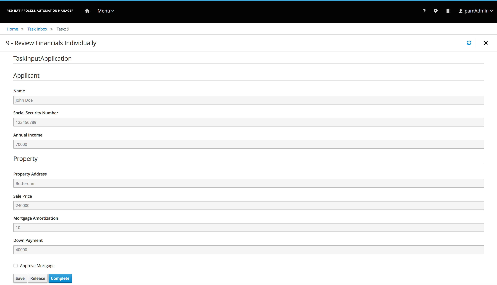

[start=20]
. Go back to the process instance page: *Menu -> Manage -> Process Instances*
. Notice that the process instance is gone.
. In the panel on the left of the screen, enable the *State > Completed* checkbox.

image::images/process-instance-filter-state-completed.png[]

[start=22]
. Click on the completed process instance to open the details page.
. Open the process instance diagram and observe that the mortgage has been denied.

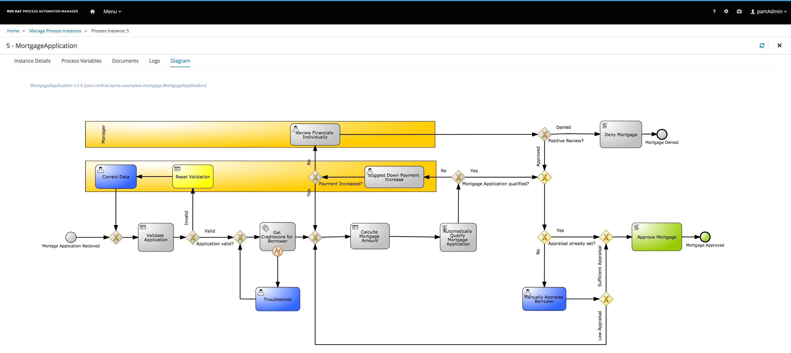
=== Examine Denied Mortgage Application Sequence Flow condition

In this section, we inspect the decision that causes the mortgage application to be denied.

. Log in in to Business Central .
* If you have closed your Business Central browser tab and need additional instructions on how to access Business Central, refer to the section that reviews the OpenShift Container Platform components in the previous lab.
. Navigate to the `Mortgage_Demo` project.
. Open the `Mortgage Application` process.
. Find the *Review Financials Individually* human task.
. Follow the sequence flow that leads out of that task to the gateway labeled *Positive Review?*
. Click on the sequence flow out of that gateway that is labeled *Denied*.
. If not open, open the `Properties` panel by clicking on the `<<` icon on the right side of the editor.
. Click on the *Expression* property and in the editor field, click on the `∨` icon to open the editor.
. Observe that this sequence flow is executed when the `brokerOverride` boolean is set to false. This boolean is the value set with the checkbox labeled *Approved Mortgage* in the *Review Financials Individually.
+
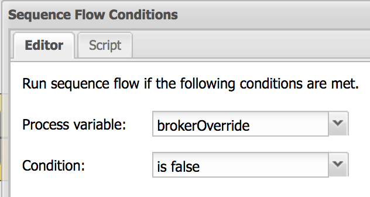
