:scrollbar:
:data-uri:
:toc2:
:greeting_repo: link:https://github.com/gpe-mw-training/dm7-customer-greeting/tree/greeting[Greeting Repository^]
:linkattrs:

== Project Creation Lab

In this lab, you use Business Central to create a client onboarding data enrichment project.
This project will include data objects, process definitions, decision tables and forms.
It's an example that aims to show basic and more advanced features and constructs of Red Hat Process Automation Manager 7.

Projects can group a set of business assets together. By using projects, you can organize the assets that affect organization decisions.

.Goals
* Create a project
* Practice using data object models
* Create the initial process definition.

.Prerequisite
* Successful completion of the _Environment Setup Lab_

:numbered:

== Define Business Case

In this section, you create a business processes that will gather additional information of a client that is in a Client Onboarding process.
The initial sign-up of the client has been done. During this *Enrichment* process, the client needs to provide additional information:
* the clients main address
* various documents that will be required during the following Legal and Know Your Customer (KYC) validations.

The type of documents required depends on the type of client and is defined by business rules, in our case a decision table.

A full Client Onboarding process might look like this
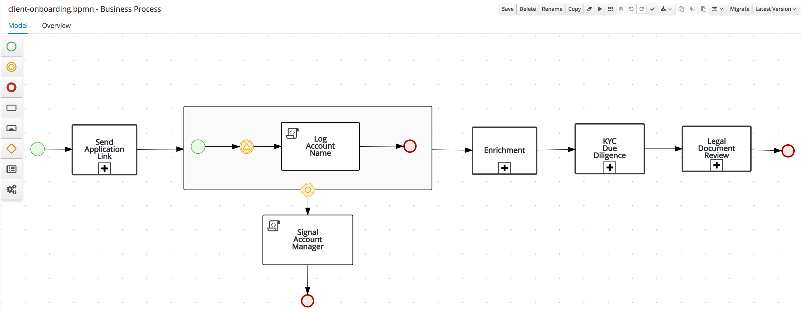
Here we will implement the *Enrichment* subprocess of this process.

== Create Client Onboarding Enrichment Project

. Log in to Business Central.
. On the home page, click *Design*.
. In the project library view, click *Add Project*:
+
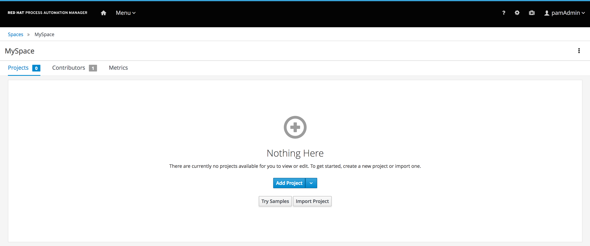
+
[TIP]
====
The context menu icon is located just above *Add Project*. The context menu provides options for importing existing projects that you use later in the course:

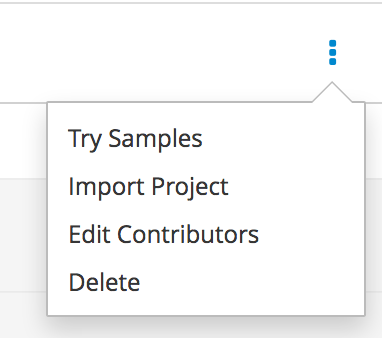
====

. Complete the *Add Project* dialog using these values:
* *Project Name*: `client-onboarding-enrichment`
* *Description*: `Client Onboarding Enrichment`
+
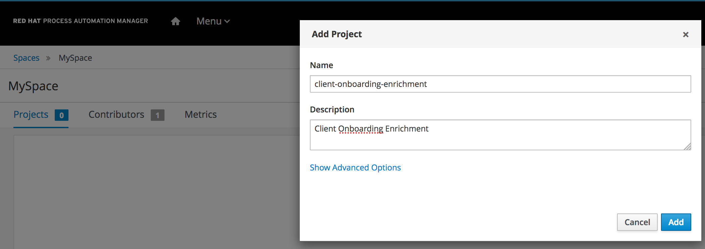
* Only the project name is required.
* It is a common practice to link the words that make up a project name with hyphens, as done in this case. This is preferred to using spaces between the words, because using spaces results in file names with spaces in them.
* Be sure to select short project names--using one to four words.
* The *Show Advanced Options* link allows specification of Maven component details that enable projects to link dependencies between each other.

. Click *Add*.
* Expect to see confirmation that the `client-onboarding-enrichment` project is successfully created.
* An empty project view is displayed for the project:
+
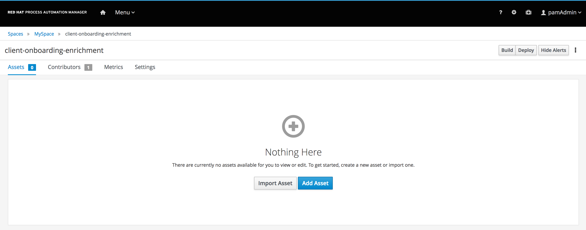
* Note the buttons in the middle of the page that allow you to add assets to the project, as well as the *importing items* link at the bottom of the page.

== Define the Enrichment Proces

In this section, you define the first part of the Clien Onboarding Enrichment process.

=== Create the Process definition

The process definition in BPMN2, defines the structure and semantics of our process. In this first part of the lab, we will simply create
a process skeleton, the overall flow of the process. At later stages of this lab and the next labs, we will gradually implement various
features of the process, including datamodels, decision, forms and tasks.

. In the empty project view of the `client-onboarding-enrichment` project, click *Add Asset*.
. In the *Add Asset* view, click on the *Business Process (legacy)* tile. (note that we'll be using the legacy process designer in this lab!!!).
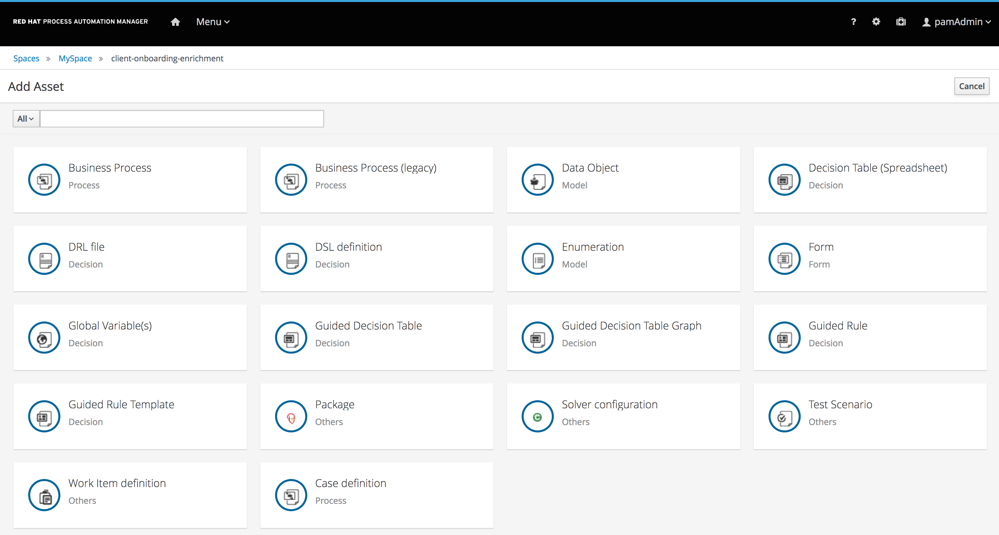
. The *Create new Business Process* form will display. Give the process the name `EnrichmentProcess`

+
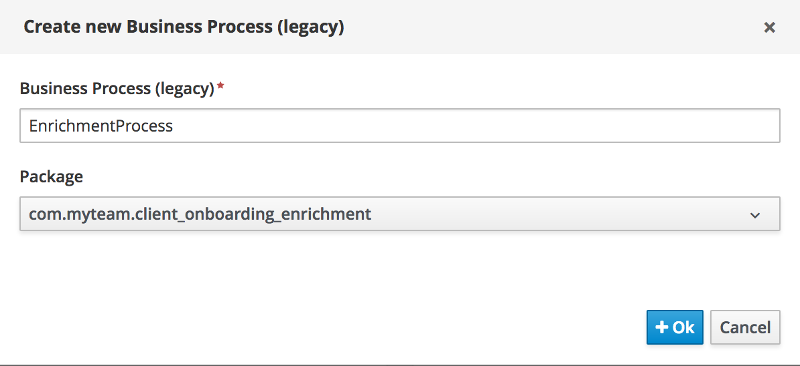
* *Business Process* is one of 18 item types that allow a designer to easily create different business assets such as rules, processes, decisions, and test scenarios:
+

* For *Business Process Name*, use Pascal case--that is the practice of writing compound words or phrases such that the first letter of each concatenated word is capitalized. Following this convention helps when you are integrating the data objects with other IT components and reusing the data objects between other entities.

* Process Automation Manager assets are organized in packages. By default, the package is defined by the space name and the project. You can also create your own package definitions. Packages help the engine to identify different assets that are named in the same way. For example, if you define a data object named `Request` in `project1` and another data object also named `Request` in `project2`, and then create dependencies between both projects, the package name where each `Request` data object definition is stored differentiates them. This is also the case with reserved item names--the package name of your data objects allows the engine to differentiate your data objects from built-in data objects with reserved names.

. Click *Ok*.
* Expect the `EnrichmentProcess` business process to be opened in the BPMN2 designer.
* You will use the designer to create the BPMN2 enrichment process shown earlier.
+
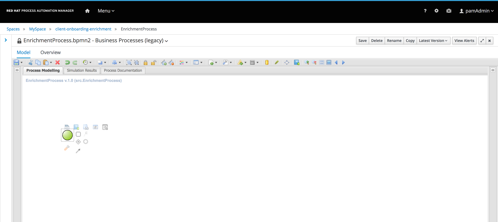
. Our process consists of 2 parallel flows. One flow in which we ask the user to add additional details to his/her profile, and one flow in which we ask the user to uploaded the required documents.
To create a parallel flow within a BPMN2 process, we will use the *Parallel Gateway*. On the left hand side of the editor, open the palette by click on the ">>" icon. Click on *Gateways* and drag the
*Parallel Gateway* onto the canvas, next to the *Start Event* (visualized as a green circle).
. To connect the *Start Event* and the *Parallel Gateway*, click on the *Start Event*. This will open a small menu. In this menu, grab the arrow icon, called an *Edge* and drag it onto the *Parallel Gateway*. This will create connection between the 2 nodes.
+
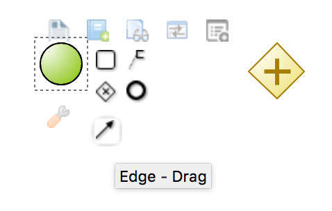
+
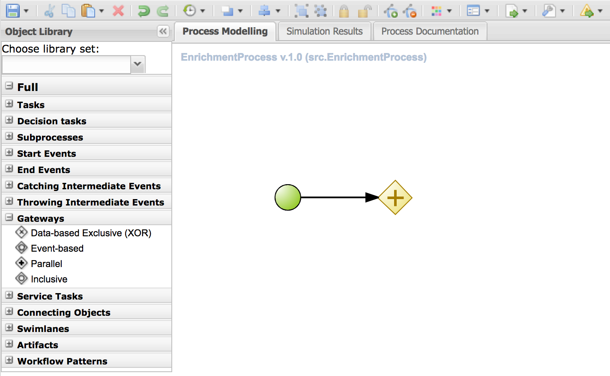
+
. We will first create the workflow that consists of a User Task to add additional details. Instead of dragging BPMN2 constructs from the palette onto the canvas, these constructs can also be created directly from within the canvas.
Click on the *Parallel Gateway*, this will open a small menu. In the menu, click on the *Node* icon. This will create a *None Node*, connected to the *Parallel Gateway*.
+
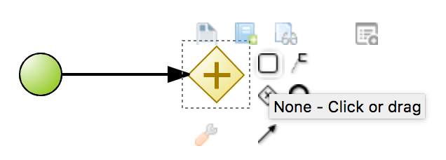
+
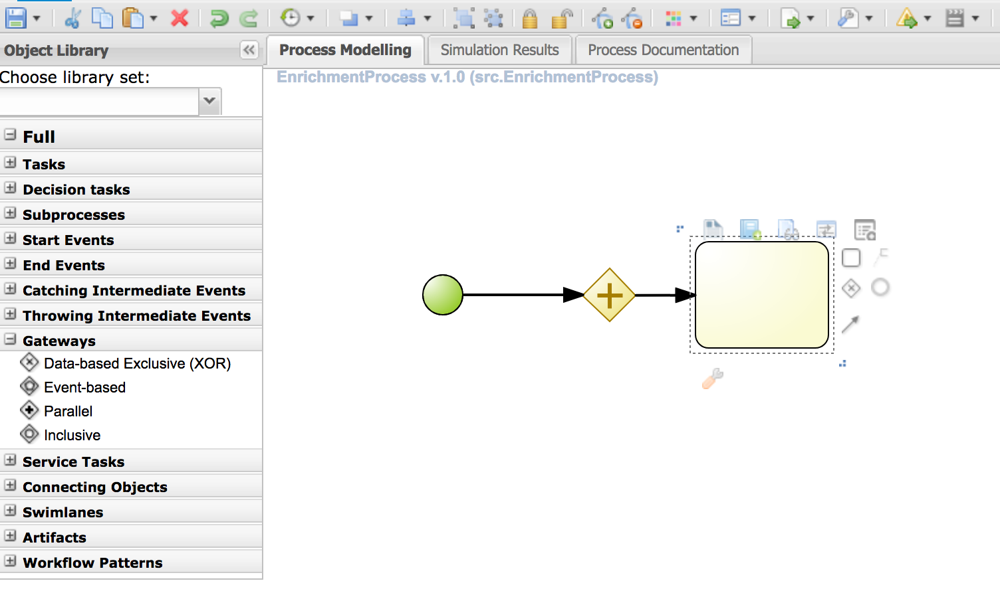
+
. The *None Node* needs to be reconfigured to the task type that we need. To do this, click on the node and in the menu that opens, click on the _wrench_ icon. A menu will pop-up. From this menu, select *User Task*. This will change the task type of this node to *User*.
+
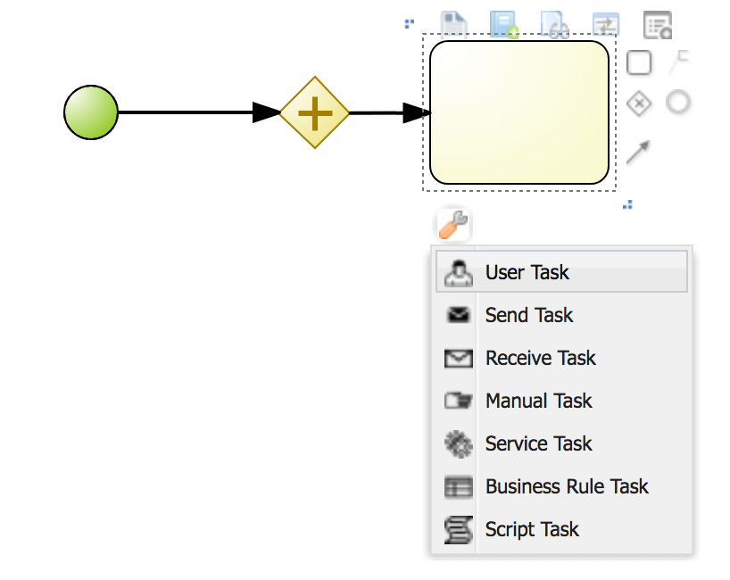
+
. A *User Task* requires some properties to be set, like the name of the task, the input and output data, and the actors and/or groups to which the task will be assigned.
In this lab we will only configure the name. We will revisit the task properties in a later lab to provide additional configuration.
Click on the *User Task* to select it. Click on the "<<" icon on the left side of the designer to open the properties panel.
Add the following properties:
* *Name*: `Add Client Details`
* *Task Name*: `add-client-details`
Note that the *Name* property is mainly used for labeling purposes, while the *Task Name* field is the identifier of the task used by the runtime again.
+
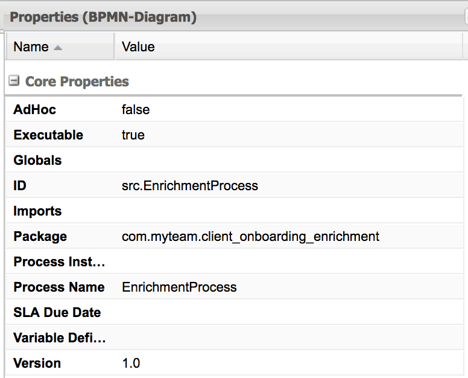
+
. Change the layout of the model by dragging the icons around to create a model as shown below. This will allow us later to add an additional flow below our first flow.
+
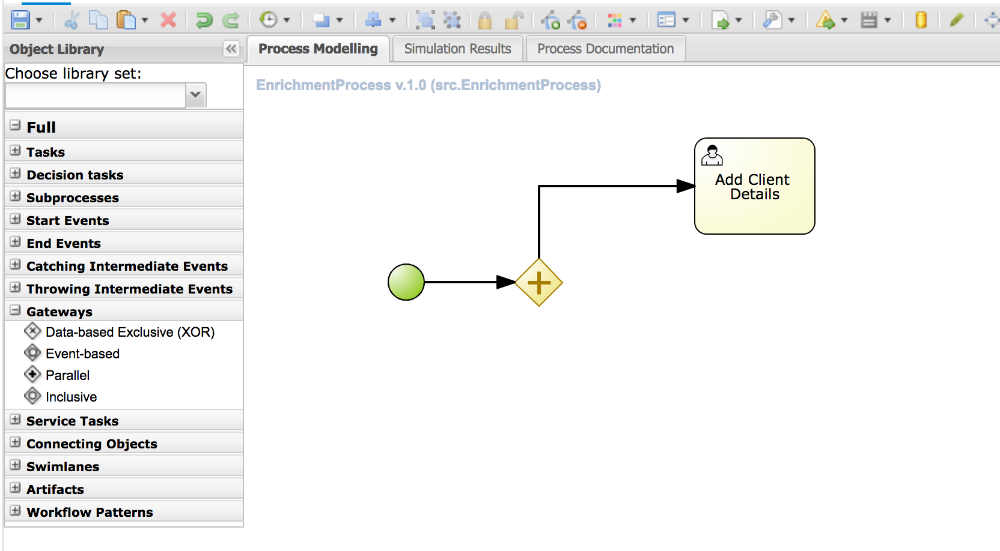
+
. Click *Save* to save the changes. A dialog will open in which you can add a *Check in comment*. Good practice is to state what kind of changes were made to the process and why. This allows for easier monitoring of changes by other team members in the future.
Click *OK* to save the changes. Expect to see a notification that the process has been successfully saved.
. We will now add the skeleton/outline of the second flow. Open the palette on the left-hand side of the editor, expand the *Tasks* section and drag *Business Rule* task on the canvas.
. Connect the *Parallel Gateway* to the *Business Rule Task*.
. Instead of using the properties panel to set the name of the node, we can also simply do this within the canvas by double-clicking on the node. Double-click on the *Business Rule* node and give it the name `Determine Documents`.
We will later revisit this node to configure the actual rules that should be evaluated within the context of this node.
+
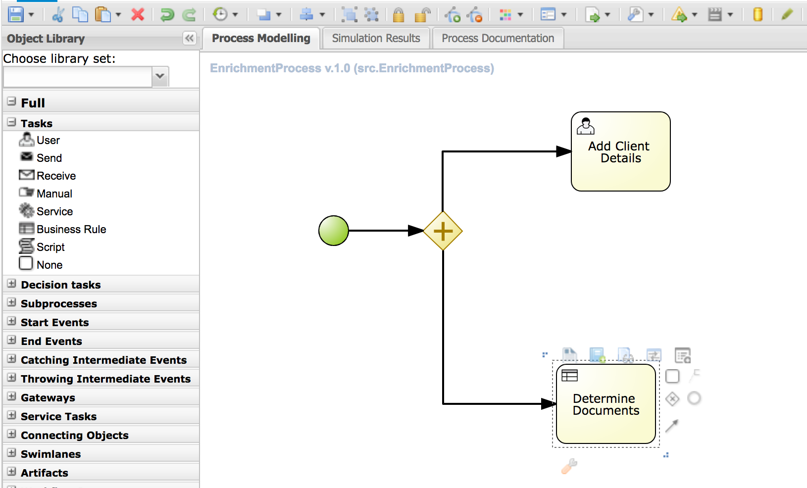
+
. The task of the rules will be to define which documents the user needs to upload. For each of these documents we want to start a so-called sub-process.
Therefore, we will use a construct called a *Multi Instance Sub Process*, which allows us to create multiple instances of this process depending of the number of items in a collection (we will configure this part later).
* Open the palette, expand the *Subprocesses* section
* Drag the *Multiple instances* subprocess onto the canvas.
* Connect it to the *Business Rule* task.
* Give it the name `Upload Documents`.
In a later part of the lab we will implement the process logic within the multi-instance subprocess.
+
image::images/after-upload-documents-multi-instance-designer-legacy.png[]
+
. We now need to connect the 2 parallel flows together and add an *End Event* to our process. We do this with a *Converging Parallel Gateway*,
which is the exact same construct as *Paralle Gateway* we used earlier, except this time, the gateway will have 2 incoming connections instead of outgoing connections
* Drag a *Parallel Gateway* onto the canvas and place it after the `Add Client Details` task and the `Upload Documents` subprocess.
* Connect the `Add Client Details` task to the gateway.
* Connect the `Upload Documents` subprocess to the gateway.
. Finally, add an *End Event* to the process and connect it to the converging gateway.
+
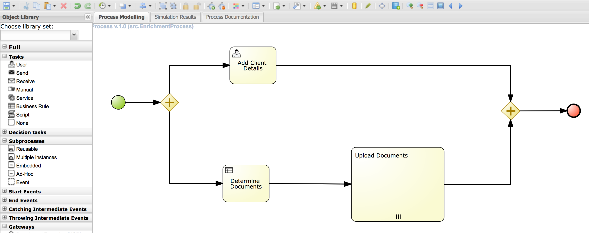
+
. Save the process.

=== Validate the Process definition
The designer provides functionality to validate the model, and determine whether there are any validation errors. This allows the user to determine problems early in the design process.

. Click on the *Start Validating* button in the menu of the designer.
+
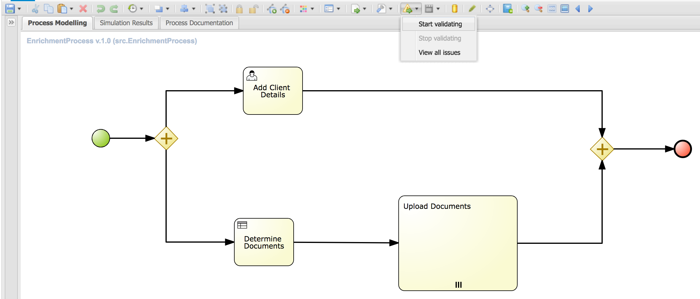
+
. Notice that the `Determine Documents` *Business Rule* task will be highlighted in red, indicating that there is a problem with this node.
. Click on the `Determine Documents` *Business Rule* task. This will open the *Validation Suggetions* menu. The issue is a BPMN2 issue, and the problem is that we have not defined a *ruleflow-group* on the rule task.
. The *ruleflow-group* defines the collection of rules that need to be evaluated in the context of this rule node.
* Close the *Validation Suggestions* menu.
* With the `Determine Documents` task still selected, open the property panel of the editor and look for the *Ruleflow Group* property.
* Give the property the value `enrichment-required-documents`. We will later add rules to our project (in the form of a decision table) on which we will set the same group name.
* Notice that the validation error is gone.
. Save the process.

== Conclusion
You've completed this part of the lab. In this lab you have
. Created your first Process Automation Manager project.
. Created a *Business Process* asset using the legacy designer.
. Created a skeleton/outline of the *Client Onboarding Enrichment* process.

In the following labs we will gradually enhance and improve this process until we have a fully executable process.
