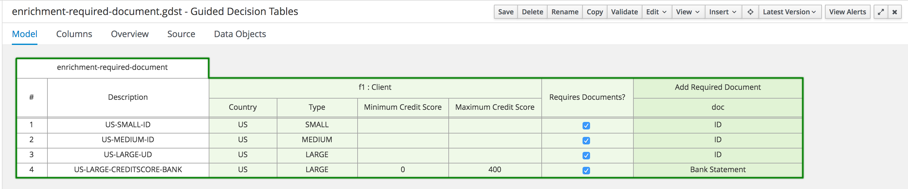
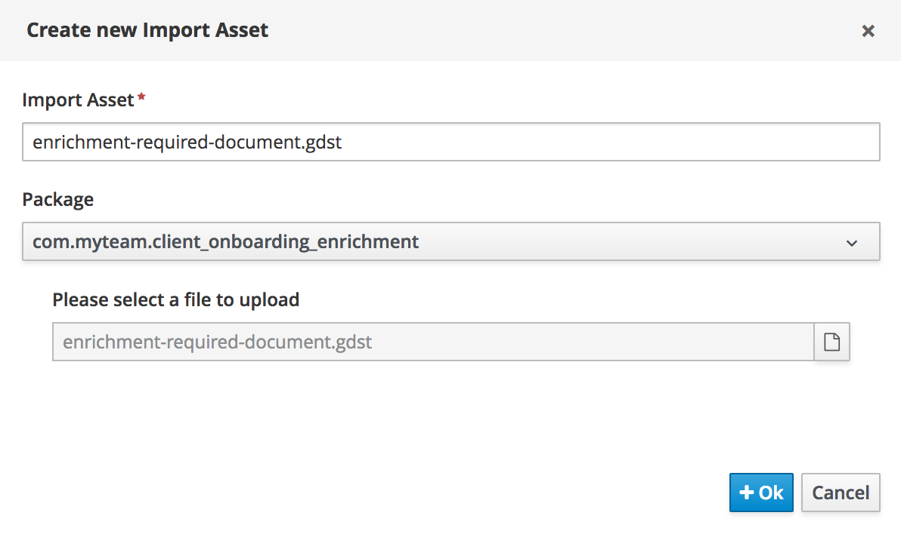
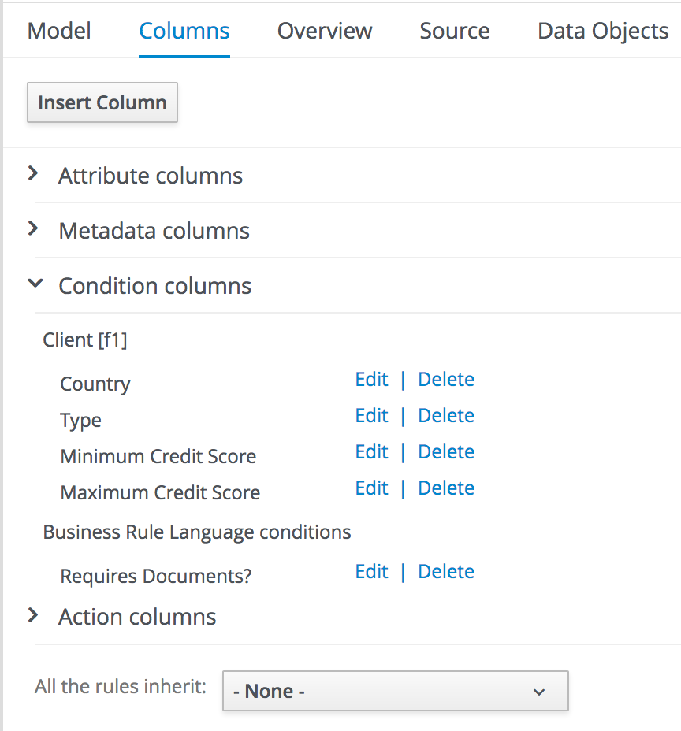
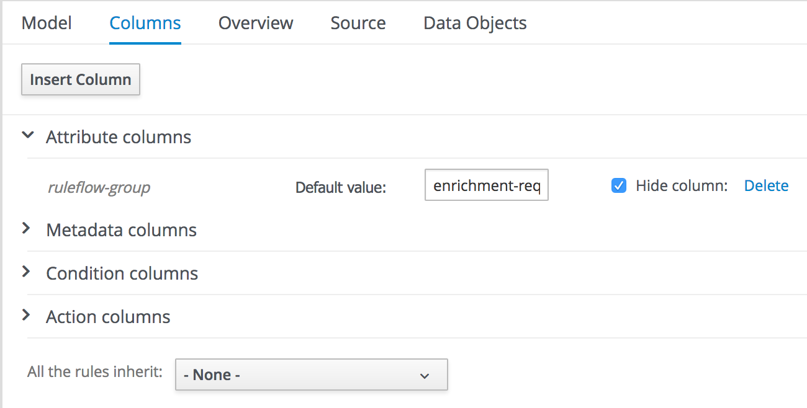

:scrollbar:
:data-uri:
:toc2:
:gitHub_repo: link:https://github.com/DuncanDoyle/rhpam7-client-onboarding-enrichment-repo[GitHub repository^]
:linkattrs:

== Import Assets Lab

In the previous lab, you created the initial process definition/outline of our *Client Onboarding Enrichment* process.
In this lab, you create the decision logic to determine which documents the client needs to upload.

As you can see in the decision table, the rules define constraints on a `Client` *Data Object*. We will create this part of the domain model in a later lab in which we will explore the domain object editor.

.Goals
* Import decision tables into an existing project

.Prerequisites
* Successful completion of the _Create Project Lab_
* Successful login to Business Central
* A `client-onboarding-enrichment` project

:numbered:

== Download Existing Assets

In this section, you download the GitHub repository to an accessible directory in the file system.

. Navigate to the {gitHub_repo}.
. From the *Clone or download* menu on the GitHub web page, click *Download ZIP*:
+
image::images/github-download-zip.png[]
. Using your favorite file system navigation tool, locate the downloaded ZIP file and unzip it to a directory in your file system.
* From this point forward, this location is referred to as `$PROJECT_HOME`.

== Import Enrichment Required Document Decision Table.

. In Business Central, open the `client-onboarding-enrichment` project. When in the *Library* perspetive, click *Import Asset* on the right hand side of the screen. This will open a dialog.
. Name the uploaded file `enrichment-required-document.gdst`, and in the file selection field navigate to the `enrichment-required-document.gdst` file under the `$PROJECT_HOME/client-onboarding-enrichment/src/main/resources/com/myteam/client-onboarding-enrichment` directory, then click *Ok*:
+

* After the import process, expect the `enrichment-required-document` decision table to display:
. Examine the contents of the `enrichment-required-document` decision table, by selecting the *Columns* tab in the editor and expanding the *Condition columns* and *Action columns* sections.
Click on the *Edit* links to open the column definition wizard. Explore the various configuration options *Condition* and *Action* columns.
+

. In the same *Columns* tab, expand the *Attribute columns* section. Observe that *ruleflow-group* attribute has already been set to the value `enrichment-required-documents`.
This matches the value of the *ruleflow-group* property in our *Business Rule* task we created in the previous lab.
This means the the rules defined in this decision table will be evaluated as part of the execution of the *Business Rule* task in our process.
+

. Close the decision table editor by clicking the *x* in the upper right of the page.
