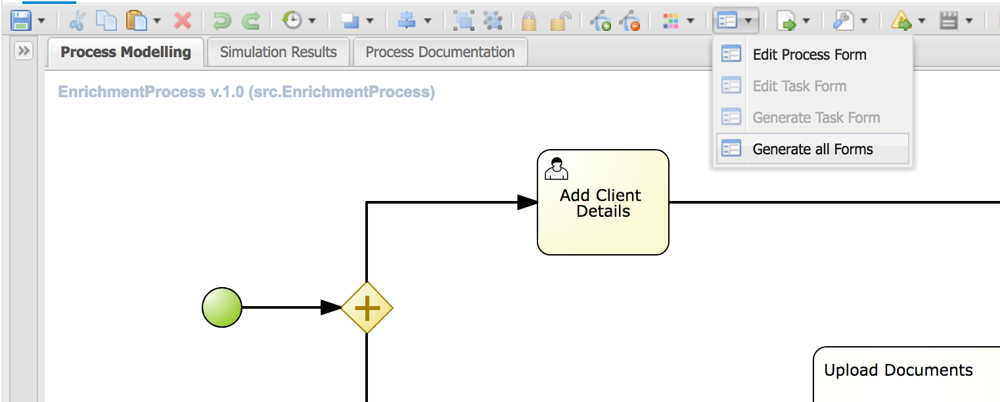
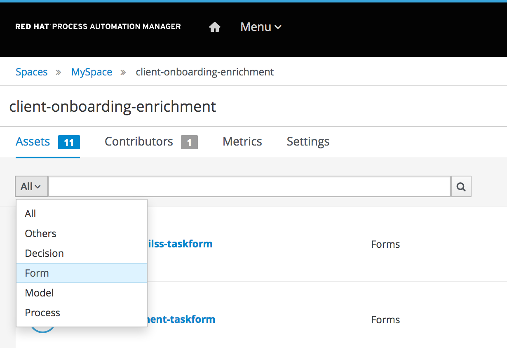
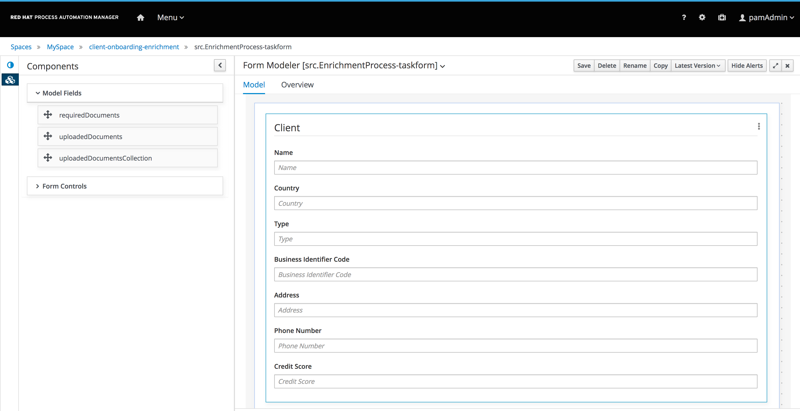
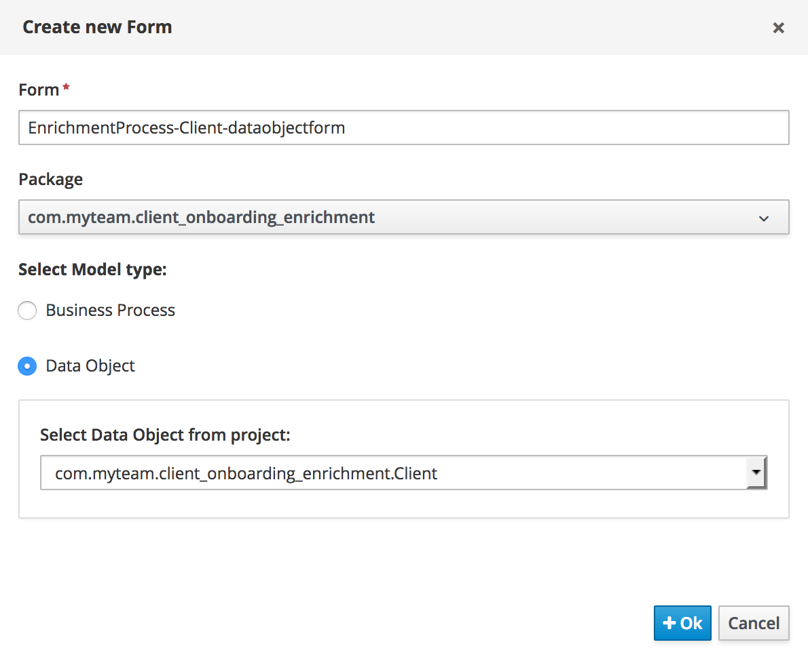
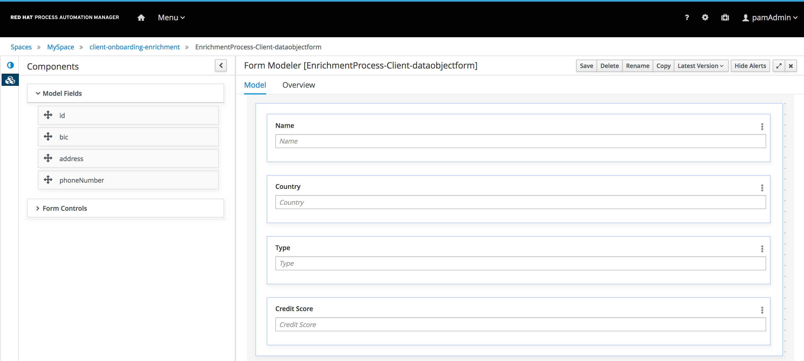

:scrollbar:
:data-uri:
:toc2:

== Forms Lab

In this lab, you will create the forms of the User Tasks that we have defined in our process, as well as the form to start the process.

The PAM BPMN2 designer provides a very easy way to create Form definitions: it can automatically generate the start-form and the forms
for all the user tasks defined in your process. The forms can of course also be manually created by clicking on the *Add Asset* button
an choosing the *Form* asset type.

In this lab we will use the easier option and have PAM generate the forms for us.

. Open the `EnrichmentProcess`. In the editor, click on the *Generate all Forms* button the designer's menu.

+
. Expect to see a green notification pop-up stating that the process and task forms have been generated.
. Go back to the Asset Library view, click on the filter drop-down list and select *Form*.

+
. Five forms have been generated. One process start form, which will be used to, as te name implies, pass data to the process when a new process instance is started.
There are three task forms. One for each *User Task* in our process. And the fifth form is a data object form for the *Client* data object.

This last form is needed because the new Form Modeler only provides bindings for primitive types, Strings and numbers (Integer, Double, etc.) to Form fields.
When a so called *Model Field* is a complex object, like *Client*, the Form Modeler will bind that field to a sub form, a form for that specific data-type.
You can have more than one data object or data type form. For example, it might be that in one *User Task* form you want to only display a subset of the fields of a *Client*,
and in another *User Task* form you want to display all the data. In that case, you can created 2 data object forms for the *Client* type, one for each *User Task*.

Let's examine the process start form `src.EnrichmentProcess-taskform`.

. Open the `src.EnrichmentProcess-taskform`. You'll see a simple, generated, form that allows us to enter the *Client* fields.

+
. Click on the *Model Fields* category on the left-hand side of the editor. This shows all the process variables, or in the case of tasks, task-variables, that can be added to the form.
. Click on the *Form Controls* category. This shows a rich set of out-of-the-box form controls that can be used in our form modeler using a WYSIWYG-style editing style.
. Let's improve the start form a bit. There is 2 things that we want to change to this form:
* Limit the fields we can fill in for a client. Note that in our process we ask the client to provide additional details.
So let's limit the input of the client data to 4 fields: `name`, `country`, `type` and `creditscore`.
* Add some HTML form controls to improve the look-and-feel of the form. We can for example add a title and an image.
. First we will limit the values of our *Client* subform. Click on the kebab icon on the right in the *Client* section of the form and click *Edit*. This will open the edit menu for the `client` *Model Field*, the `client` process variable.
* Observe that the *Field Type* is set to *SubForm*, and the *Nested Form* is the *Client* form.
. At this point we can do 2 things, either change the *Client* form and remove the unwanted fields, or we create a new form for the *Client* data object.
Since the *Client* form is used in other *User Task* forms as well, we choose to create a new data-object form for *Client*.
. Go back to the project's Asset Librart by using the bread-crumb navigation and click on *Add Asset*.
. Filter on *Form* and click on the *Form* asset tile.
. Give it the *Name* `EnrichmentProcess-Client-dataobjectform`, leave the *Package* as is, and select *Data Object*.
In the *Select Data Object from project* drop-down list select `com.myteam.client_onboarding_enrichment.Client` and click *OK*.

+
. In the Form Editor, click on the *Model Fields* category. This will list all the fields of our *Client* data object.
. Drag the `name` field onto the canvas. This will open the *Field Properties* editor. Examine the options that it provides. We will use the default configuration for now, so click *OK*.
. In the same way, add the other three fields: `country`, `type` and `creditScore`. Use the default properties, or try to add a *Help Message* or change the *PlaceHolder*.

+
. Save the form
. Go back to the start process form `src.EnrichmentProcess-taskform`. Click again on the kebak icon next to *Client* to open the *Field Properties* for the `client` field of this form.
. In the *Nested Form* drop-down list, select the form we just created: `EnrichmentProcess-Client-dataobjectform` and click *OK*.
. The form layout will change and now only shows the input fields we require when we start the process.
. Save the form.

We will now add some additional HTML components to improve the look-and-feel of our form.

. Click on the *Form Controls* category.
. Drag the HTML component to the top of the form. This will open the HTML editor.
. Use a *H1* header (called *big title* in the editor) to increase the font, center the text and make it bold. Add the following text: *Add a New Client*.
. Add a second HTML component just under the first one. Click on the *Insert image* icon in the HTML editor and point it to the following image: 

== Running the Process
With the entire project complete, from data objects, to rules, processes and forms, it's now time to deploy our project on the *Process Server*/*Execution Server*/*KIE Server*
