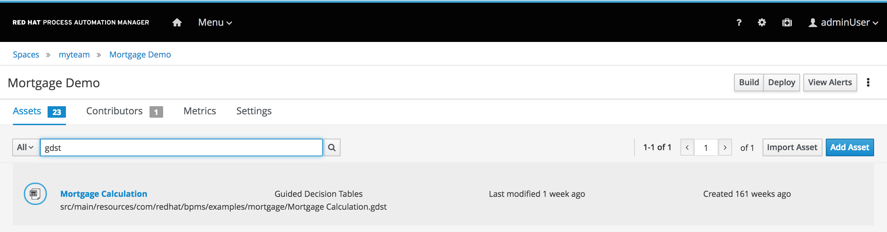
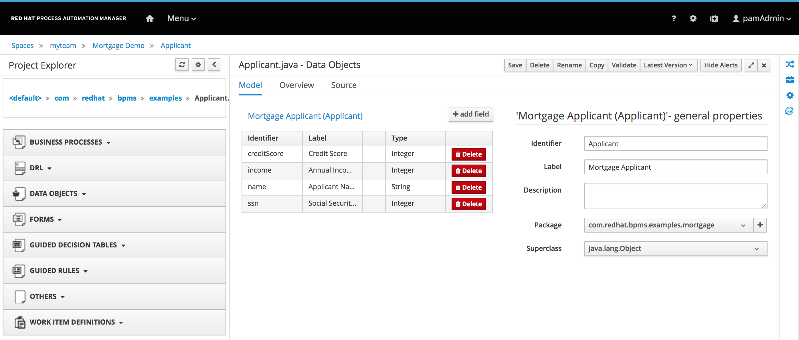
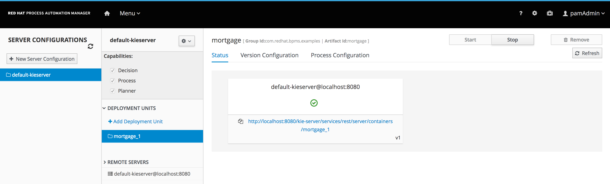
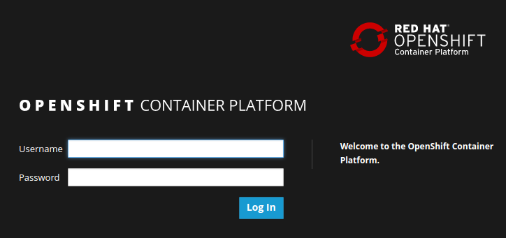

:scrollbar:
:data-uri:
:toc2:

== Assets Navigation Lab

This module showcases the new Case Management features supported in PAM 7 it will use the  Business Central environment provisioned during the _Environment Setup Lab_.n module 1.  The business assets are retrieved from the `IT Orders` sample project, one of the demonstration samples available.

In this lab, you will import the `IT Orders` project in the Business Central workbench of Red Hat Process Automation Manager 7.
You will navigate the project's assets, like case definitions, rules, case properties, and forms, in the project's library.
You will build and deploy the project onto the the Process Server, the platform's ligth-weight runtime engine, after which we will start a IT Order process instance.
Finally, you will explore the runtime process and task management using the process instance created in the previous step, to highlight the differences in the execution of a case.

.Goals
* Become familiar with business assets and their organization for a case project.
* Search for and open business assets for viewing and understanding the differences between a case and a project at configuration level.
* Become familiar with the build and deployment process of a case 
* Start a process instance and explore the REST api to interact with them. 

.Prerequisites
* Successful completion of the _Environment Setup Lab_
* Successful login to Business Central

:numbered:

== Create a sample Case Project

Go to the Design view in Business Central project.

image::images/empty-library-perspective.png[]

With an empty project library view, you have the option to create a project, try a sample, or import an existing project.

In this lab we will use a sample to create a new Case Management project.

. From the empty project library view, click *Try samples*. Or from a non-empty project library click on the right hand upper side and select *Try Samples*  
* You will be redirected to the samples page where you can select the sample project, in this case we will select the IT Orders Case management project.
. In the *Import Project* dialog, enter `https://github.com/jbossdemocentral/rhpam7-mortgage-demo-repo` for *Repository URL* and click *Import*:
+
image::images/import_pamf_lab2.png[]
* If the repository contains multiple projects, you will be asked which project you would like to import. In this case the repository only contains the `Mortgage Demo` project, which will be imported immedetialy.
* When the import is completed, the project library view appears with the `Mortgage Demo` project selected:
+
image::images/mortgage-demo-project-library.png[]

== Navigate Project Library

The project library view shows a tabular list of the assets in the project.
The tabular list allows the user to:

* Filter assets by type.
* Search for assets.
* Navigate between asset pages.

=== Filter assets by type
At the top left of the tabular list of assets, you see drop-down list. The list allows you to filter the assets by type.

image::images/filter_assets_by_type.png[]

. Filter on `Process`
. Filter on `Decision`
. Filter on `Model`
. Filter on `Form`
. Set the filter to `All`

=== Search for Assets

At the top of the tabular list of assets, you see a search input field.
The grid is filtered by the asset's fully-qualified name, and the match is not case-sensitive.

. Search for `gdst`.
. Search for `Mortage`.
. Search for `Validate`.
. Clear the search field.

=== Navigate between asset pages

At the top right of the tabular list of assets, there is a pagination control that allows the user to navigate between pages.

. Find the page controller.
. Navigate to the next page and back.

== Download Project

Projects can be exported so you can use them to upload to a source code repository and import them later into another instance of Business Central or distribute them outside the environment where they were created.

=== Export Project

To export the project, you start from Business Central's home page.

. Click the *Home* icon from the upper panel to access the Business Central home page.
. Click *Design* to display the project list.
* Note that the empty project library view you saw earlier is now populated with the `Mortgage Demo`.
. Select the `Mortgage Demo` project.
* This shows the project's library view with a list of its assets.
. Select the `Applicant` asset, the second asset in the table, and if the *Project Explorer* panel is not displayed, click the blue *>* icon to open it.
* This opens the *Project Explorer* perspective:
+

*  The *Project Explorer* view is accessible only when you select any of the assets from the project's library view.
. Click the gear icon in the *Project Explorer* panel and select *Download Project*
to trigger the download in your browser:
+
image::images/settings-gear.png[]
* A ZIP file containing the package structure of your project is downloaded to your `Downloads` folder. The name of the ZIP file is structured like this: `[Space Name]-[Repository Name]_[project name].zip`.
* Expect to find a file called `myteam_rhpam7-mortgage-demo-repo.zip` in your `Downloads` folder.
+
[NOTE]
In some cases, the file name may be missing a `[Space Name]-` prefix.

=== Deploy Mortgages Demonstration Project

It is useful to know how to create an executable component from a project. Executable components are stored in a binary repository (Maven) so that they can be used as dependencies for other projects. Executable components are also distributed to _execution servers_. Execution servers are the runtime containers that allow process execution from the Business Central workbench and client applications.

In this section, you deploy the `Mortgage Demo` demonstration project and use the Business Central workbench to test the deployment.

The `Mortgage Demo` demonstration project is a Process Automation Manager project intended to demonstrate the use of Process Server to execute a Mortgage Application business  process.

. Click the *Home* icon from the upper panel to access the Decision Central home page.
. Click *Design* to show the project list.
. Select the `Mortgage Demo ` project.
* This shows the project's library view with a list of its assets.
. Click *Deploy* from the set of buttons in the upper right.
* Expect to see confirmation of a successful deployment.
. Click the *Home* icon from the upper panel.
. Click *Deploy* to display the *Deploy* perspective.
* This shows the list of servers and containers:
* Alternatively, you can click *Menu -> Deploy -> Execution Servers* to navigate to the server page.
+

. Verify that the `mortgage_1` KIE container shows a green circle with a checkmark, indicating successful deployment.
**TODO: REPLACE SCREENSHOT WITH AN UPDATED VERSION WITHOUT THE BUG THAT DOESN'T DISPLAY THE SERVER! (AND ONE THAT SHOWS OPENSHIFT)**
+
[NOTE]
====
Note that the IP address for the remote server is an internal host IP address for the OpenShift environment. This means that while the IP address is accessible from within the OpenShift platform components, you cannot access this IP address from outside the OpenShift environment--for example, from your browser.
In order to access the KIE containers from outside the OpenShift environment, you need a Process Server route, which you get from the list of pods in OpenShift Container Platform.
====
. If you are not already logged in to OpenShift Container Platform, log in using your OPENTLC credentials:
+

. Select the Process Automation Manager project from your project list:
+
image::images/projects-list.png[]
**TODO: UPDATE IMAGE!**

. Locate the Process Server deployment whose name begins with `gpte-kieserver` in the list and click the *>* icon to the left to display details of this deployment:
+
image::images/external-route-execution-server.png[]
**TODO: UPDATE IMAGE!**

. From the *Networking* section in the Process Server pod, select one of the entries under *ROUTES External Traffic* and open the link in a new window.
. By default the Process Server route needs additional details about the information that you are requesting.
* Expect to see a `Forbidden` message result:
+
image::images/execution-server-forbidden.png[]
**TODO: UPDATE IMAGE**

. Add `/docs` to the end of the URL in your browser route.
* Expect to see the KIE server remote API reference documentation:
+
image::images/execution-server-rest-api.png[]
. Navigate to the **KIE Server :: Core** section.
. Click on the **GET /server/conainers** entry to expand the section.
. Click on the *Try it out* button on the right.
. Leave all the fields empty and click on the *Execute* button.
. The *Server Response* section will show the response confirming the existence of the the `mortgage` container.
+
image::images/swagger-get-containers.png[]
+
[NOTE]
====
The RESTful endpoint of Process Server are _secured resources_. This means that you need to present credentials to access the resource, for example when you press the _Execute_ button in the API documentation. You use the same credentials (`adminUser` for the username and `test1234!` for the password) that you used for entering Decision Central from the _Environment Setup Lab_ .
====

== Execute Test Cases

In this section, you execute a number of test scenarios:

* An approved mortgage loan application
* A loan application denied because the loan requester is not old enough
* A loan application denied because the loan requester's credit history is not acceptable

=== Test Approved Mortgage Loan Application

In this section, you use the following example data to generate an approved response from the engine:

[cols="2",options="header"]
|=======================================
|Field|Value
|*Applicant Name*| `John Doe`
|*Applicant Age*| `35`
|*Credit Rate*| `AA`
|*Bankruptcy Detected*| `False` (unchecked)
|*Income Validated*| `True` (checked)
|*Income Amount*| `70000`
|*Income Type*| `Job`
|*Loan Amount*| `25000`
|*Deposit Max Amount*| `1500`
|*Mortgage Rate*| `20`
|=======================================

. If you do not see the *Mortgage Loan Evaluation* page, select the *Mortgages* option.
. Enter the example data into the loan evaluation form:
+
image::images/approved-loan-data.png[]

. Click *Submit*.
* Expect to see a pop-up dialog indicating that the loan is approved:
+
image::images/approved-loan-result.png[]
. Click *OK* to dismiss the dialog.

=== Test Denied Loan Application Due to Applicant's Age

In this section, you enter loan application data that generates a denied response from the engine. Then you examine the rule that causes the application to be denied.

You use the following example data, where only the applicant's age is different from the previous example data:

[cols="2",options="header"]
|=======================================
|Field|Value
|*Applicant Name*| `John Doe`
|*Applicant Age*| `15`
|*Credit Rate*| `AA`
|*Bankruptcy Detected*| `False` (unchecked)
|*Income Validated*| `True` (checked)
|*Income Amount*| `70000`
|*Income Type*| `Job`
|*Loan Amount*| `25000`
|*Deposit Max Amount*| `1500`
|*Mortgage Rate*| `20`
|=======================================

. Update the *Applicant Age* field to `15`, keeping the other data fields the same as the previous example.

. Click *Submit*.
* Expect to see a pop-up dialog indicating that the loan is denied:
+
image::images/old-enough-result.png[]

. Click *OK* to dismiss the dialog.

=== Examine Denied Decision Rule

In this section, you find the rule that is making the decision to deny the loan.

. Log in in to Decision Central.
* If you have closed your Decision Central browser tab and need additional instructions on how to access Decision Central, refer to the section that reviews the OpenShift Container Platform components in the previous lab.
. Navigate to the `mortgages` project.
. Search for `underage`.
* Expect to see results similar to this:
+
image::images/underage-search.png[]
. Click the `Underage` asset to open the `Underage.rdrl` file and examine its contents:
+
image::images/underage-rdrl.png[]

=== Test Denied Loan Application Due to Bad Credit History

As in the previous section, you enter loan application data that generates a denied response from the engine. Then you examine the rule that causes the application to be denied.

You use the following example data, changing the applicant's age back to `35` and changing the credit rating from `AA` to `OK`:

[cols="2",options="header"]
|=======================================
|Field|Value
|*Applicant Name* | `John Doe`
|*Applicant Age* | `35`
|*Credit Rate* | `OK`
|*Bankruptcy Detected* | `False` (unchecked)
|*Income Validated* | `True` (checked)
|*Income Amount* | `70000`
|*Income Type* | `Job`
|*Loan Amount* | `25000`
|*Deposit Max Amount* | `1500`
|*Mortgage Rate* | `20`
|=======================================

. Return to the `mortgages` web application page.

. Enter the example data as shown or, if the previous form is still populated, change the applicant's age to `35` and set the credit rating to `OK`.
. Click *Submit*.
* Expect to see a pop-up dialog indicating that the loan is denied:
+
image::images/only-aa-result.png[]

. Click *OK* to dismiss the dialog.

=== Examine Denied Decision Rule

In this section, you find the rule that made the decision to deny the loan.

. Navigate to the `mortgages` project in Decision Central.
. Search for `credit check`.
. Click the `No bad credit checks` asset to open the `No bad credit checks.rdrl` file.
. Examine the contents of the `No bad credit checks.rdrl` file.
