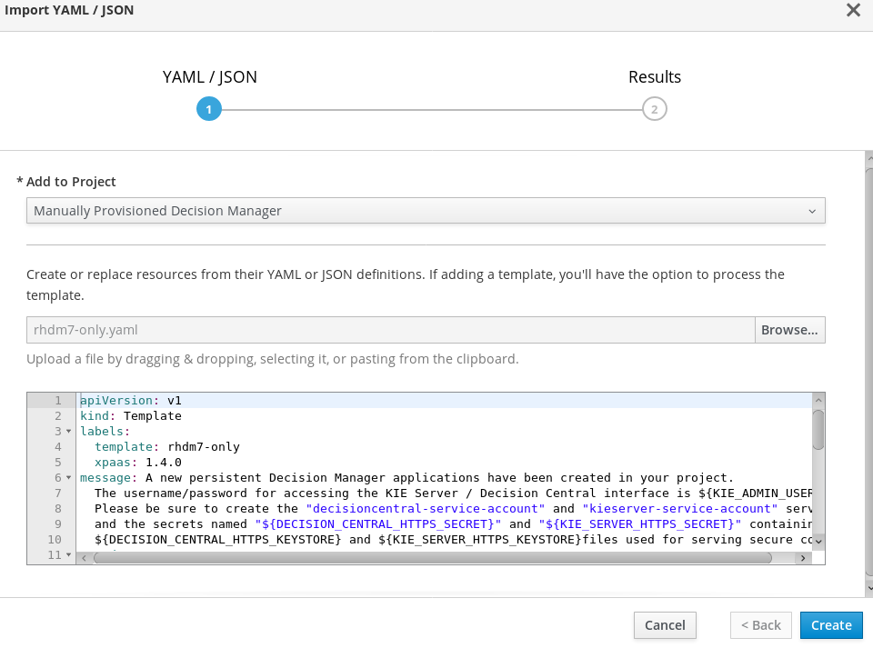
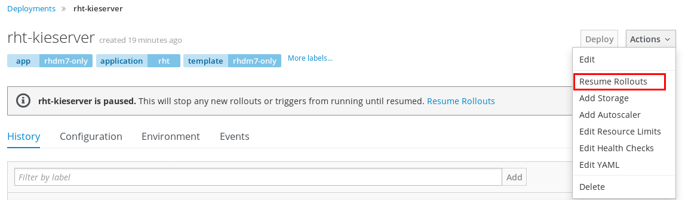
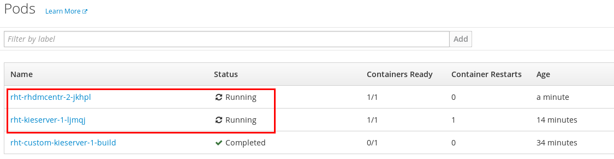
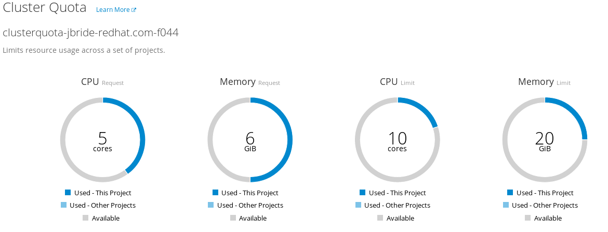
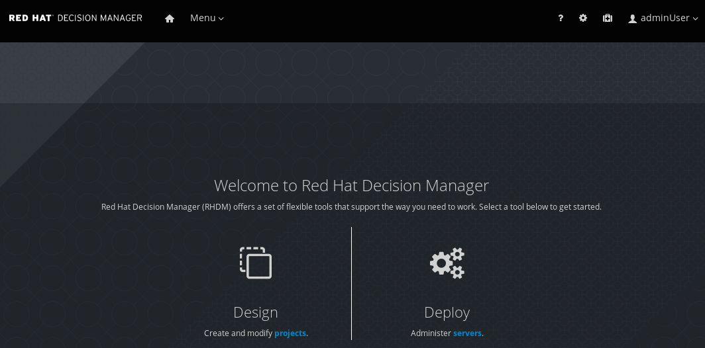

:scrollbar:
:data-uri:
:toc2:
:pam_template: link:https://raw.githubusercontent.com/gpe-mw-training/bxms_decision_mgmt_foundations_lab/master/resources/rhdm7-only.yaml[Process Automation Manager template]

= Process Automation Manager Provision Lab

.Goals
* Provision the Process Automation Manager in an OpenShift environment

:numbered:

== Overview

TO-DO:  Update these links for PAM once GA

The Red Hat Process Automation Manager product can be provisioned in either of the following environments:

. Any combination of JVM, OS and application container detailed in the link:https://access.redhat.com/articles/3354301[Red Hat Process Automation Manager Support Configurations document].
+
The installation procedure for this approach can be found in the link:https://access.redhat.com/documentation/en-us/red_hat_decision_manager/7.0/html-single/installing_red_hat_decision_manager_on_premise/index[supported product documentation].
+
This lab does not discuss this installation approach.
. In an OpenShift Container Platform environment
+
The focus of this lab is on this approach.
+
Related documentation on this installation procedure can also be found link:https://access.redhat.com/documentation/en-us/red_hat_decision_manager/7.0/html-single/deploying_red_hat_decision_manager_on_red_hat_openshift_container_platform/index[here].

The Process Automation Manager product will be provisioned in a single remote Openshift project.
For the purpose of this lab, this single remote OpenShift project is provided to you; you do not need to install the OpenShift Container Platform.

== Register for access to an OpenShift Container Platform environment

In this section of the lab, you register for the ability to create a project in your remote OpenShift lab environment.

. In your browser, navigate to the link:https://labs.opentlc.com/[OPENTLC lab portal]:
+
image::images/cf_home.png[]

. Enter your OPENTLC username and password and click *Login*.
. Navigate to *Services -> Catalogs -> OPENTLC Middleware Solutions Labs -> RHT PAM 7 Foundations*:
+
image::images/cf_ocp_item.png[]

. Click *Order* in the panel on the right.

. In the next panel, check the confirmation checkbox and then click *Submit* in the lower right corner.

. Expect to receive an email with contents similar to the following:
+
-----
Your OTLC-ADM-jbride-redhat.com-PROD_SHARED_DEVELOPER_ENV-f044 has been provisioned.
Please take note of your unique identifier, GUID: f044

Access to the requested environment will be granted as soon as the environment deployment is complete.
Your environment will be hosted in our shared cluster, accessible at: https://master.na37.openshift.opentlc.com
-----
+
This email confirms access to a remote OpenShift Container Platform environment.
Please save this email.
+
Pay particular attention to the URL of the OCP master node referenced in this email.
You will be navigating to this OCP master node for the duration of this course.

. Using your browser, log into the master node of the Openshift Container Platform mentioned in the lab confirmation email.
+
Use your OPENTLC user credentials to authenticate.

. In the top right the homepage, click the `Create Project` button:
+
image::images/create_ocp_project.png[]

. Fill in the pop-up form with the following values:

.. *Name*: bxms-pam-manual-provision-<your initials>
.. *Display Name*: Manually Provisioned Process Automation Manager
.. *Description*: Manually Provisioned Process Automation Manager

. Click on the new project and navigate to the following to view Quotas and Limit Ranges: `Resources -> Quota`
.. The top section details the `ClusterQuota` assigned to your user account.
+
It is set by the OpenShift system administrator to define resource limits at an aggregate level.
.. The bottom section details the `LimitRange` automatically assigned to your OCP project.
+
It also is set by the OpenShift system administrator to define limits and defaults on individual pods and containers.

The clusterquota and limitranges assigned allow for a successfull deployment of Red Hat Process Automation Manager.

Now that you have access to an OCP lab environment and have created a project, you are now prepared to provision the Red Hat Process Automation Manager product in that project.

== Process Automation Manager template

The Red Hat Process Automation Manager product includes a variety of OpenShift templates that define all of the artifacts to be provisioned for a Process Automation Manager deployment.

=== PAM Template Overview

Details of the list of templates offered are as follows:

. *rhpam70-authoring.yaml*
+
Description: An example of a recommended authoring environment for most customers where scalability and reliability requirements do not rise to levels justifying a high-availability setup.
Technical Content: Single replica of business central configured to use a persistent volume, set up to tightly integrate with an instance of the KIE server, using business central as its Maven repo and persisting process data to H2, backed by a persistent volume.

. *rhpam70-authoring-ha.yaml*
+
Description: An example of a recommended highly-available authoring environment for most customers requiring significant scalability and reliability.
Technical Content: Two default replicas of business central running on an EAP cluster, using elasticsearch and AMQ, and configured with a shared persistent volume, set up to tightly integrate with two replicas of the KIE server, using business central as its Maven repo and persisting process data to PostgreSQL.

. *rhpam70-sit.yaml*
+
Description: An example of a recommended integration testing environment for most customers.
Technical Content: Single replica of business central monitoring, connected to a smart router, configured for two distinct sets of KIE servers, configured with an external Maven repo and  persisting to different instances of PostgreSQL.

. *rhpam70-prod.yaml*
+
Description: An example of a recommended production environment, with the expectation that a majority of current customers would run something very similar.
Technical Content: Three default replicas of business central monitoring, configured for single sign-on with RH-SSO integration, connected to two replicas of the smart router, configured for two distinct sets of KIE servers, pointing to an external Maven repo and persisting to different instances of PostgreSQL.

. *rhpam70-prod-immutable-monitor.yaml*
+
Description: An example of a recommended production environment for an expected minority of customers who wish to run immutable containers that cannot be managed.
Technical Content: Three default replicas of business central monitoring, configured for single sign-on with RH-SSO integration, connected to two replicas of the smart router, configured for connection to distinct sets of S2I KIE server images using container-local maven, that can be created through an associated template.

. *rhpam70-prod-immutable-kieserver.yaml*
+
Description: An immutable KIE server used optionally connecting to a monitoring console
Technical Content: Two replica of KIE server using s2i to generate container-local maven data and persisting to PostgreSQL. May optionally point to a smart router and/or monitoring.

. *rhpam70-trial-ephemeral.yaml*
+
Description: A short-living trial environment that can be quickly and easily installed
Technical Content: Business central with ephemeral local git tightly coupled to a KIE server using ephemeral H2 database and pointing to business central as its Maven service.

. *rhpam70-kieserver-postgresql.yaml*
+
Description: An example of a managed KIE server used with a monitoring console
Technical Content: Single replica of KIE server with required configuration to use an external Maven service, and included PostgreSQL database. May optionally point to a smart router.

. *rhpam70-kieserver-mysql.yaml*
+
Description: An example of a managed KIE server used with a monitoring console
Technical Content: Single replica of KIE server with required configuration to use an external Maven service, and included MySQL database. May optionally point to a smart router.

. *rhpam70-kieserver-externaldb.yaml*
+
Description: An example of a managed KIE server used with a monitoring console
Technical Content: Single replica of KIE server with required configuration to use an external Maven service, and required configuration to persist to an external database. May optionally point to a smart router.

These templates can be found link:https://github.com/jboss-container-images/rhpam-7-openshift-image/tree/rhpam70-dev/templates[here].

=== Quiz

Templates are intended to be tweaked as needed by application developers.
For the purpose of this lab, we'll use a {pam_template} that includes slight variations from the out of the box rhpam70-authoring.yaml template.

. Point your browser to the {pam_template} and save a copy to your local filesystem so that you can more easily study it.
. Open the template in a text editor and notice the following about it:
.. The majority of the template consists of a list of `objects:` (starting at around line 19) and a list of template `parameters` (starting at around line 531).
.. There are two `DeploymentConfig` artifacts defined that when started will create two pods:
... _rhdmcentr_ : This defines the details of your `Decision Central` web application.
... _custom-kieserver_ : This defines the details of your _kie-server_ pod where your rule applications run.
+
The customization made to it is that it is CORS enabled to allow a web application to invoke its REST API.

. Study the template and test your understanding of the template by answering the following questions:
.. Are the deployment configs defined in the template initially in a paused state?
.. What are the values of the limits and requests specified for the _kie-server_ pod ?
.. What are the values of the limits and requests specified for the _Decision Central_ pod ?
.. What will be the userId and password to authenticate into the Decision Central web application ?

ifdef::showscript[]

Answers:

endif::showscript[]

== Provision

. In the OpenShift web console, navigate to the homepage of your _Manually Provisioned Process Automation Manager_ project.
. In the `Get started with your project` section, click the button: `Browse Catalog`
+
image::images/browse_catalog.png[]
. In the header of the page, click `Import YAML/JSON`
+
image::images/click_yaml.png[]
. Populate the form as follows:
.. *Add to Project*: Select your project from the selection list.
.. Click `Browse` and select the yaml based template that you previously downloaded to your local filesystem.
. Once the `Create` button is enabled, click it.
+

. At the `Add Template` pop-up, ensure the `Process the Template` checkbox is checked and then click `Continue`.
. Change the values of the following template parameters as follows:
.. *Application Name*: rht
.. *KIE Admin Password*: test1234!
. Click `Create`

== Verify

. Return to the homepage of your `Manually Provisioned Process Automation Manager` project.
. Navigate to: `Builds -> Builds`
+
Notice that a build called `rht-custom-kieserver` should be in-progress and working toward completion.
This build artifact layers the Process Automation Manager with CORS related configurations.
+
image::images/ks_build.png[]
. Once the `rht-custom-kieserver` build is in a completed status, navigate to: `Applications -> Deployments`
. There should be two deployments list:
+
.. `rht-kieserver`
.. `rht-rhdmcentr`
. For each of the deployments, start them by clicking on the deployment and in the `Actions` drop-down, select: `Resume Rollouts`
+

. Check on the resultant pods by navigating to: `Applications -> Pods`.
+
Notice that initially there are a couple of pods whose names include a suffix of: `*-deploy`.
. After a few minutes, the `deploy` pods should terminate and you'll be left with two pods in a `Running` state
+

. Return to the page in the OpenShift web console that provides details of your quotas and limit ranges.
+
Notice that your Process Automation Manager deployment should be well within the limits defined by the ClusterQuota:
+

. Review routes by navigating to: `Applications -> Routes`
. Click on the link of the _Hostname_ associated with the route called:  `secure-rht-rhdmcentr`.
. Accept the self-signed certificates and authenticate at the login prompt using:  `adminUser` / `test1234!`
. Once you login you should be able to see the Decision Central Home perspective:
+

== Conclusion
Congratulations, during this lab you provisioned the Process Automation Manager product in an Openshift Container Platform environment.
