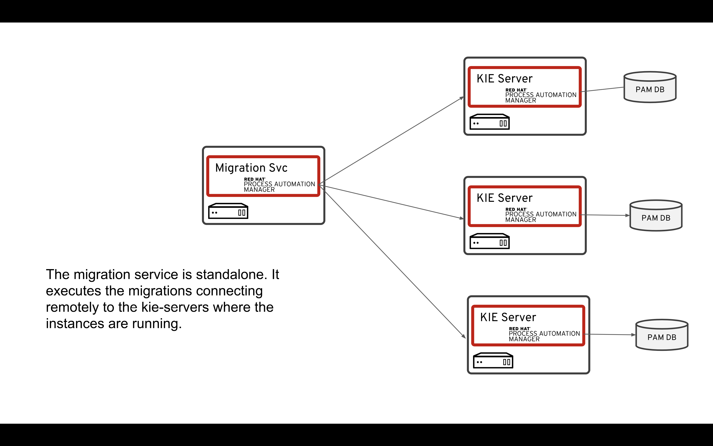

:scrollbar:
:data-uri:
:toc2:

== Process Migration

In this lab, you will use the new backend for process migration, that includes new features like async process migration.

.Goals
* Create a 2 different versions of a process
* Create a migration plan
* Execute the migration.

.Prerequisites
* JRE 1.8 or greater
* Running KIE Process server

:numbered:

== Process Migration service

This service is intended to be deployed standalone, adn just point it to the Execution Servers where the processes are running. It communicates through the API's using the REST endpoints

== Process Migration Entities

The 2 basic entities of the Migration service are:

Migration Plan

Is a definition of how the migration will be performed. Includes the following information:

* Plan ID (Generated)
* Plan name
* Plan description
* Source and target container IDs
* Node mappings (if any)

Migration

Is the execution of a defined plan, applied to a set of process instances. These are the attributes that define a Migration:

* Migration ID (Generated)
* Plan ID
* Instances to migrate.
* Execution type
    * Sync or Async
    * Scheduled start time
    * Callback URL

We can now further improve the process by implementing the multi-instance sub-process and configuring the Business Rule task and User task.

== Configuring the Add Client Details user task.
Now that we have defined the variables of our process, we can create the input and output mapping of these process variables to task variables.
In PAM, process variables and task variables are de-coupled, which means that if you want to work on a certain piece of data as part of a *User Task*,
you will need to map variable from the process instance onto the task. If you want changes made to this data as part of the task to be passed
back to the process variable, you also need to define the output mapping from task variable to  process variable.

. In the `Enrichment Process`, click on the `Add Client Details` *User Task* and open the properties panel.
. Click in the *Assignments* field on the *v* icon to open the *I/O Assignment* editor.
. Click on *+Add* next the *Data Inputs and Assignments* field. Add the following values:
* *Name*: `htClient` (the letters `ht` in this case is simply a prefix that stands for *human task*. You can use any variable name you like)
* *Data Type*: `Client`
* *Source*: `client`
What this defines is that when this user task starts, we want to map the process instance variable `client` onto the user task variable `htClient`.
. We want the client to update his/her details as part of this task. We therefore also need to define an output variable. Because the Forms in PAM
can only map a form-field or subform to a single variable, if we want to use the same fields for displaying and updating client data, we need to
define an output variable that has the same name as the input variable. So, in our case we define the following output variable:
* *Name*: `htClient` (observe that this is the same name as the one used for the input variable)
* *Data Type*: `Client`
* *Source*: `client`
This will map the changes made to the `htClient` task variable back to the `client` process variable.
+
image::images/add-client-details-user-task-io-mapping.png[]
+
. We also need to assign the task to an actor and/or group. This defines which users can be the potential owner of a task and thus can work on it.
As this is an example lab, we will simply set the value of *actor* to our own username: `adminUser`.
+
image::images/add-client-details-user-task-properties.png[]

== Configuring the Determine Documents Business Rule Task
The rules in our `Determine Documents` *Business Rule* task need to reason over data. As with the user task, we therefore need to define
an I/O mapping of process variables to task variables. In the case of a business rule task, the variables defined in the input mapping
will be inserted in the so called *Knowledge Session* (or *Working Memory*) of the rules as so called *facts*. This allows the rules to match on and reason
over these facts. Variables defined in the output mapping will be retracted from the *Knowledge Session* when the task has finished.
This is important, as by default, multiple *Business Rule* tasks in the same process will share a single *Knowledge Session*. Retracting
facts after a *Business Rule* task has finished is therefore good practice in order to prevent unwanted cross-talk and between different rule tasks and with
that, unexpected results of rule evaluations.

We want our rules to work on `client` and on `requiredDocuments`, as the rules evaluate the `client` (and its fields) and will add one or more entries to the `requiredDocuments` collection as a result of the rule evalution.

. In the `EnrichmentProcess`, click on the `Determine Documents` *Businesss Rule* task and open the properties panel.
. Add the following input mapping for the `client`:
* *Name*: `client` (observe that this is the same name as the one used for the input variable)
* *Data Type*: `Client`
* *Source*: `client`
. Add the following input mapping for the `requiredDocuments`:
* *Name*: `requiredDocuments` (observe that this is the same name as the one used for the input variable)
* *Data Type*: `java.util.List`
* *Source*: `requiredDocuments`
. We now need to define the same output mapping to make sure the facts are retracted/deleted from the session when the rule task completes.
The final mapping will look like this.
+
image::images/determine-documents-rule-task-io-mapping.png[]

For this *Business Rule* task to function correctly, we need to add one other configuration. We insert the `requiredDocuments` variable into the rules session.
However, at this stage of the process, this variable has not been initialized yet, and thus will be `null`. Therefore, the rules in our decision table will not match and fire.
To solve this issue, we need to initialize this process variable before the rules are evaluated. There are multiple ways to do this. In this lab, we will use an *On Entry Actions* script
on the *Business Rule* task to instantiate the process variable:

. Open the `EnrichmentProcess` and click on the `Determine Documents` *Business Rule* task and open the properties panel.
. Look for the *On Entry Actions* property and click on the *v* icon to open the *Expression Editor*. Add the following expression:
+
....
kcontext.setVariable("requiredDocuments",new java.util.ArrayList());
....
. Click on *OK* and save the process.

== Configuring the Upload Documents Multi Instance Subprocesss
Next we can configure the *Multi Instance Subprocess*. As said, we want an instance of this subprocess to be created for every required document defined in the `requiredDocuments` collection.
Also, each uploaded document needs to be added to the `uploadedDocumentsCollection` when the subprocess instances finish.

First we need to define the process variables of our subprocess. We need a variable that holds the name of the document that needs to be uploaded in the specific subprocess instance.
We also need a variable that can hold the uploaded document.

. In the `EnrichmentProcess`, click on the `Upload Documents` *Multi Instance Subprocess* and open the properties panel.
. Click on the *Variable Definitions* property. This allows one to configure the process variables for the subprocess.
. Add a third variable to keep track of whether the document has been approved.
* *Name*: `approved`
* *Defined Types*: `boolean`
* *Custom Type*:
* *Case File*: `false`
* *KPI*: `false`
+
image::images/multi-instance-subprocess-variables.png[]

We can now configure the multi-instance properties.

. In the properties panel of the `Upload Documents` *Multi Instance Subprocess*
. Set the followig properties:
* *MI collection input*: `requiredDocuments` : this is the input collection. For each entry in this collection, a subprocess will be created.
* *MI collection output*: `uploadedDocuments` : the output collection. Each subprocess instance will store, upon completion,  the variable defined in the *MI data output* in this collection.
* *MI data input*: `requiredDocument`: the name of the variable to which the entry in the input collection for which this subprocess is created should map.
* *MI data output*: `uploadedDocument`: the variable that should be collected on completion of the subprocess and which should be stored in the *MI colletion output*.

image::images/multi-instance-subprocess-properties.png[]

== Implementing the Upload Documents Multi Instance Subprocess
Finally we need to implement the actual process logic of the *Sub Process*. The logic of the subprocess is as follows:
. The client gets a task to upload the requested document.
. An employee of the financial service provider gets the task to verify the uploaded document.
. When the document is approved, the subprocess finishes
. When the document is not approved, the user task for the client is re-activated/re-created.

=== Creating the User Task for the client.

. Create a *Start Event* in the subprocess.
. Create a *User Task* node connected to the *Start Event*. Give it the *Name* `Upload Document - #{requiredDocument}` and *Task Name* `upload-document`. The `#{requiredDocument}` syntax in the name will be replaced at runtime with value of the `requiredDocument` process variable. This will allow us to show different task names, depending on the document the user is required to upload.
. Set our `adminUser` as the tasks *Actors*. In an enterprise implementation this would be the user-id of the client in the PAM system so he/she will be the person who gets the task assigned.
. Add the input mapping:
* *Name*: `htRequiredDocument`
* *Data Type*: `String`
* *Source*: `requiredDocument`
We don't need to change this in our user task, so we don't need to define an output mapping for this variable.
. Add the output mapping:
* *Name*: `htUploadedDocument`
* *Data Type*: `org.jbpm.document.Document`
* *Source*: `uploadedDocument`
This is the document the user will upload to the system.
. Save the process
+
image::images/user-task-upload-document-properties.png[]
+
image::images/mi-after-upload-document-user-task.png[]

=== Creating the Document Approval User Task
The idea behind the `Document Approval` *User Task* is that the document uploaded by the user needs to be approved and accepted by an internal employee before the process can continue.

. Create a new *User Task* node connected to the `Upload Document` *User Task*. Give it the name `Approve Document - #{requiredDocument}` and *Task Name* `approve-document`. Again, the `#{requiredDocument}` placeholder will be replaced at runtime with the value of the `reuqiredDocument` process variable.
. Set our `adminUser` as the tasks *Actors*. In an enterprise implememtation the task would be assigned to the group of employees qualified to approve these uploaded documents.
. Add the input mapping:
* *Name*: `htClient`
* *Data Type*: `Client`
* *Source*: `client`
We don't need to change this in our user task, so we don't need to define an output mapping for this variable.
. Add the input mapping:
* *Name*: `htRequiredDocument`
* *Data Type*: `String`
* *Source*: `requiredDocument`
We don't need to change this in our user task, so we don't need to define an output mapping for this variable.
. Add the input mapping:
* *Name*: `htUploadedDocument`
* *Data Type*: `org.jbpm.document.Document`
* *Source*: `uploadedDocument`
We don't need to change the document either, so we don't need to define an output mapping for this variable either.
. Add the output mapping:
* *Name*: `htApproved`
* *Data Type*: `Boolean`
* *Source*: `approved`
+
image::images/approve-document-user-task-mapping.png[]
+
image::images/mi-after-approve-document-user-task.png[]

=== Creating the Approval Decision Gateway and flows
Depending on whether the uploaded document has been approved or not, we need to take a decision.
For this we will use the *Data-based Exclusive (XOR)* gateway. This gateway allows us to, based on process variables or facts in the session,
take decision on which path in the process to take.

Enhance your subprocess model as show below, using the *Date-based Exclusive (XOR)* gateway and an *End Event*.

image::images/upload-documents-mi-full.png[]
+
Now we need to create the conditional logic on the *Sequence Flows* going out of the *XOR* gateway.
. Click on the arrow with the label `Yes` that connects to the *End Event* node. This is the route we want to take when the document is approved.
. Open the properties panel and click on the *v* icon in the *Expression* field. This opens the expression editor.
. Select *Process variable* `approved` and *Condition* `is true`.

image::images/sequence-flow-approved-true.png[]

We now have the option to either set the decision logic on the *Sequence Flow* labeled `No`, or we defined a *Default Gate* on the *XOR* gateway.
We'll use latter option to show this specific construct in this lab.
. Click on the *XOR* gateway on the right with the 2 outgoing flows and open the propeties panel.
. Click on *Default Gate* and select the gate labelled `No`. Note that you will only see that text if you have properly labelled the outgoing connectors.
If you have not labelled the connectors, you'll simply see their generated ids, which makes it default to verify whether you have configured the correct default gate.

Finally, save the process.

This completes the full process definition of our Client Onboarding Enrichment process. To be sure everything is fine, we can run the validator.
In the next lab we will create the Forms for our process and take the process for a test-drive.
